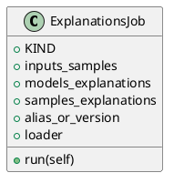

<!-- AUTOGENERATED_START -->
# src/regression_model_template/jobs/explanations.py

## Module Overview
Define a job for explaining the model structure and decisions.

## Dependencies
- `typing`
- `pydantic`
- `regression_model_template.core`
- `regression_model_template.io`
- `regression_model_template.jobs`

## Public API
## Classes
### Class `ExplanationsJob`
Generate explanations from the model and a data sample.

Parameters:
    inputs_samples (datasets.ReaderKind): reader for the samples data.
    models_explanations (datasets.WriterKind): writer for models explanation.
    samples_explanations (datasets.WriterKind): writer for samples explanation.
    alias_or_version (str | int): alias or version for the  model.
    loader (registries.LoaderKind): registry loader for the model.
- **Bases:** None

#### Attributes
- `KIND`
- `inputs_samples`
- `models_explanations`
- `samples_explanations`
- `alias_or_version`
- `loader`

#### Methods
##### `run`
- **Arguments:** self
- **Returns:** base.Locals

## UML

<!-- AUTOGENERATED_END -->
