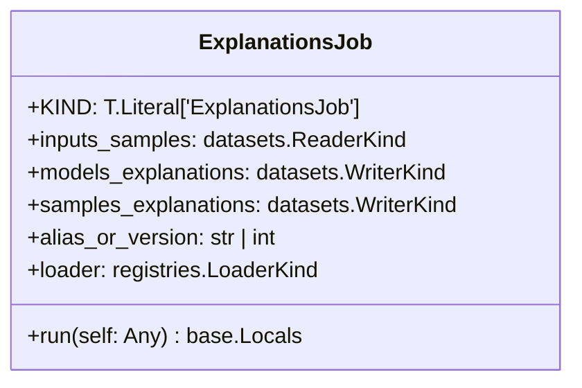
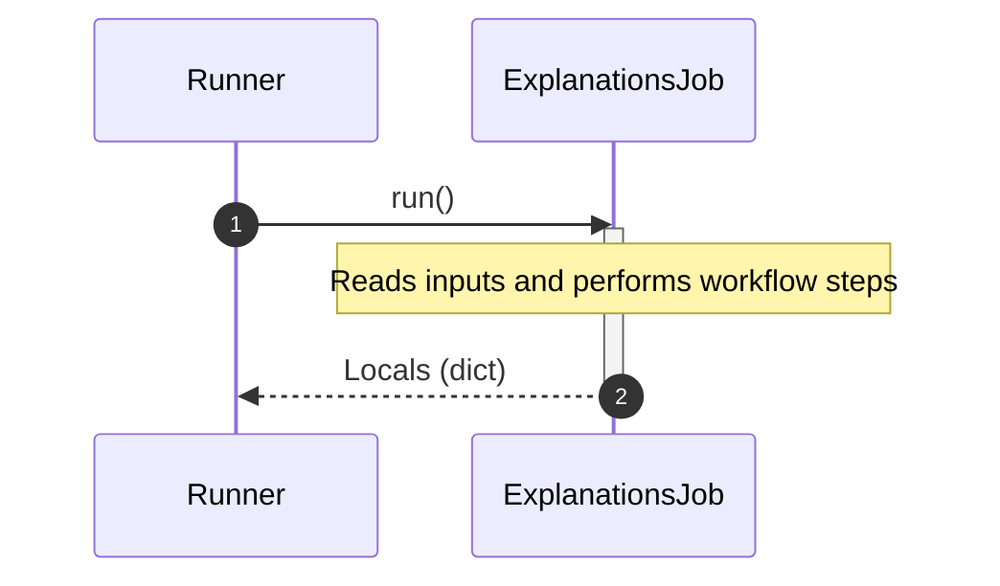

# Module Specification: explanations

* **Source Reference:** [src/regression_model_template/jobs/explanations.py](../../../src/regression_model_template/jobs/explanations.py) (Lines: L1-L78)

## 1. Architectural Role & Responsibilities
Define a job for explaining the model structure and decisions.

## 2. UML 2.0 Class Diagram

## 2b. Execution Flow (Sequence Diagram)

## 3. Class & Method Specifications

### `ExplanationsJob` ([`src/regression_model_template/jobs/explanations.py:L16-L78`](../../../src/regression_model_template/jobs/explanations.py#L16-L78))

Generate explanations from the model and a data sample.

Parameters:
    inputs_samples (datasets.ReaderKind): reader for the samples data.
    models_explanations (datasets.WriterKind): writer for models explanation.
    samples_explanations (datasets.WriterKind): writer for samples explanation.
    alias_or_version (str | int): alias or version for the  model.
    loader (registries.LoaderKind): registry loader for the model.

#### Methods

* **`run(self: Any) -> base.Locals`** (L39-L78)
  - **Purpose**: No description available.
  - **Inputs**:
    - `self` (`Any`): Parameter description.
  - **Outputs**:
    - `base.Locals`: Return value description.
