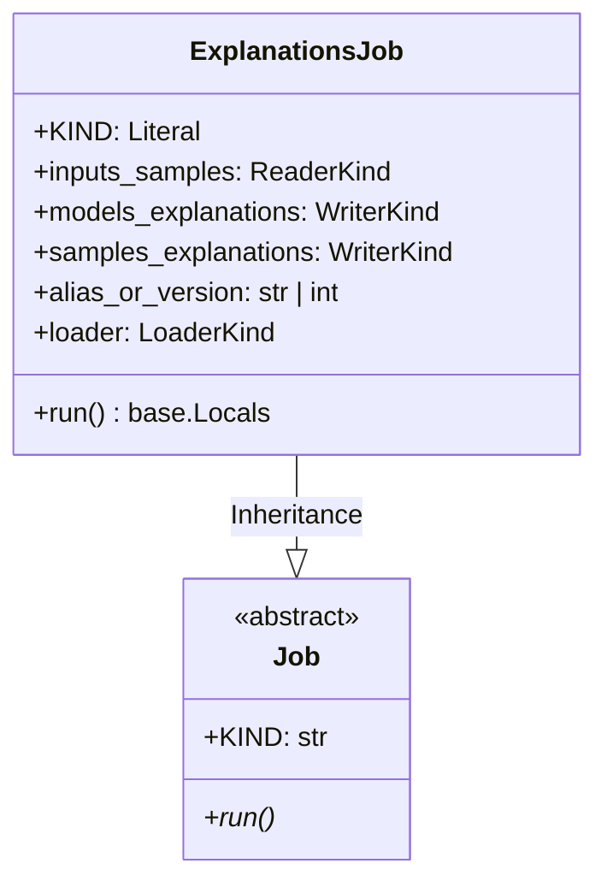

# Module Specification: SHAP Explanations Job

* **Source File Reference:** [`src/regression_model_template/jobs/explanations.py`](/src/regression_model_template/jobs/explanations.py) (Lines: L16-L78)
* **Upstream Dependencies:** [Modules/RegressionModelTemplate/Jobs/Base](base.md), [Modules/RegressionModelTemplate/Core/Models](../core/models.md)
* **Downstream Consumers:** [Modules/RegressionModelTemplate/Scripts](../scripts.md)

## 1. Architectural Role & Responsibilities
`ExplanationsJob` invokes SHAP explainers (`explain_model()`, `explain_samples()`), logging global feature importance summary plots and local attribution matrices to MLflow.

## 2. UML 2.0 Class Diagram

## 3. Class & Method Specifications

### `ExplanationsJob` ([`src/regression_model_template/jobs/explanations.py:L16-L78`](/src/regression_model_template/jobs/explanations.py#L16-L78))
* `run(self)` (L39-L78): Generates SHAP explanation values for test set samples and logs explainability figures.
