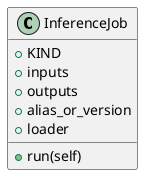

<!-- AUTOGENERATED_START -->
# src/regression_model_template/jobs/inference.py

## Module Overview
Define a job for generating batch predictions from a registered model.

## Dependencies
- `typing`
- `pandas`
- `pydantic`
- `regression_model_template.core`
- `regression_model_template.io`
- `regression_model_template.jobs`

## Public API
## Classes
### Class `InferenceJob`
Generate batch predictions from a registered model.

Parameters:
    inputs (datasets.ReaderKind): reader for the inputs data.
    outputs (datasets.WriterKind): writer for the outputs data.
    alias_or_version (str | int): alias or version for the  model.
    loader (registries.LoaderKind): registry loader for the model.
- **Bases:** None

#### Attributes
- `KIND`
- `inputs`
- `outputs`
- `alias_or_version`
- `loader`

#### Methods
##### `run`
- **Arguments:** self
- **Returns:** base.Locals

## UML

<!-- AUTOGENERATED_END -->
