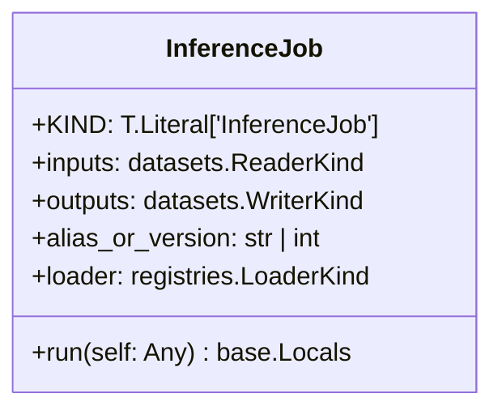
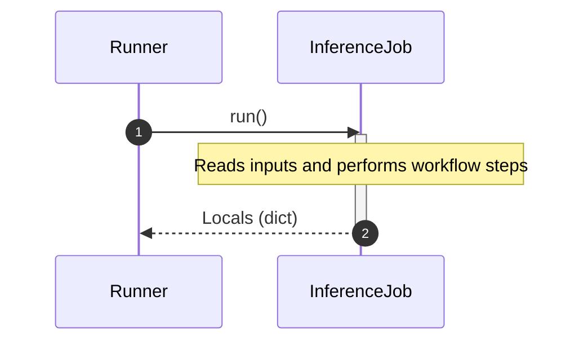

# Module Specification: inference

* **Source Reference:** [src/regression_model_template/jobs/inference.py](../../../src/regression_model_template/jobs/inference.py) (Lines: L1-L66)

## 1. Architectural Role & Responsibilities
Define a job for generating batch predictions from a registered model.

## 2. UML 2.0 Class Diagram

## 2b. Execution Flow (Sequence Diagram)

## 3. Class & Method Specifications

### `InferenceJob` ([`src/regression_model_template/jobs/inference.py:L17-L66`](../../../src/regression_model_template/jobs/inference.py#L17-L66))

Generate batch predictions from a registered model.

Parameters:
    inputs (datasets.ReaderKind): reader for the inputs data.
    outputs (datasets.WriterKind): writer for the outputs data.
    alias_or_version (str | int): alias or version for the  model.
    loader (registries.LoaderKind): registry loader for the model.

#### Methods

* **`run(self: Any) -> base.Locals`** (L38-L66)
  - **Purpose**: No description available.
  - **Inputs**:
    - `self` (`Any`): Parameter description.
  - **Outputs**:
    - `base.Locals`: Return value description.
