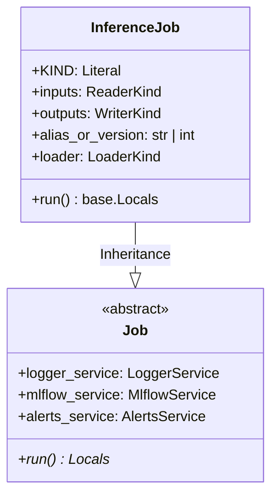

# Module Specification: Batch & Online Inference Job

* **Source File Reference:** [`src/regression_model_template/jobs/inference.py`](/src/regression_model_template/jobs/inference.py) (Lines: L17-L67)
* **Upstream Dependencies:** [Modules/RegressionModelTemplate/Jobs/Base](base.md), [Modules/RegressionModelTemplate/IO/Registries](../io/registries.md), [Modules/RegressionModelTemplate/IO/Datasets](../io/datasets.md)
* **Downstream Consumers:** [Modules/RegressionModelTemplate/Scripts](../scripts.md)

## 1. Architectural Role & Responsibilities
`InferenceJob` loads active production model (`CustomLoader`), processes batch input datasets (`ParquetReader`), runs vector predictions, and writes output Parquet predictions (`ParquetWriter`).

## 2. UML 2.0 Class Diagram

## 3. Class & Method Specifications

### `InferenceJob` ([`src/regression_model_template/jobs/inference.py:L17-L67`](/src/regression_model_template/jobs/inference.py#L17-L67))

`InferenceJob` is a concrete execution job that retrieves a deployed model candidate from the MLflow model registry (by model version or alias, e.g., the default "Champion" model alias) and generates batch prediction outputs from feature dataset inputs.

#### Methods

* **`run(self) -> base.Locals`** (L38-L67)
  - **Purpose**: Executes the batch prediction pipeline. Loads the target model candidate, ingests the inputs dataset, runs inference predictions, writes out predictions, and sends alert notifications.
  - **Steps Executed**:
    1. Obtains the configured Logger and MLflow client handles.
    2. Ingests the batch inputs dataframe from the inputs reader connector.
    3. Performs Pydantic schema validation to ensure input features strictly comply with the schema contract.
    4. Computes the target model's MLflow registry URI based on the registry name and model version/alias.
    5. Loads the model pipeline object into memory using the registry loader connector.
    6. Runs predictions on the inputs dataframe using the loaded model instance.
    7. Formats the predictions dataframe and writes it to the output target writer connector.
    8. Dispatches an execution completion alert containing the final predictions dataframe shape.
  - **Inputs**: None.
  - **Outputs**:
    - `base.Locals` (`dict`): Dictionary containing all local variables (including the final generated `outputs` dataframe).
