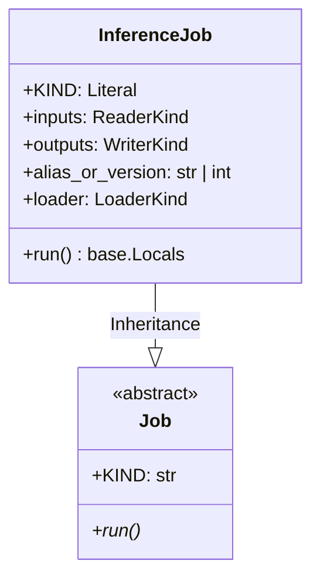

# Module Specification: Batch & Online Inference Job

* **Source File Reference:** [`src/regression_model_template/jobs/inference.py`](/src/regression_model_template/jobs/inference.py) (Lines: L17-L66)
* **Upstream Dependencies:** [Modules/RegressionModelTemplate/Jobs/Base](base.md), [Modules/RegressionModelTemplate/IO/Registries](../io/registries.md), [Modules/RegressionModelTemplate/IO/Datasets](../io/datasets.md)
* **Downstream Consumers:** [Modules/RegressionModelTemplate/Scripts](../scripts.md)

## 1. Architectural Role & Responsibilities
`InferenceJob` loads active production model (`CustomLoader`), processes batch input datasets (`ParquetReader`), runs vector predictions, and writes output Parquet predictions (`ParquetWriter`).

## 2. UML 2.0 Class Diagram

## 3. Class & Method Specifications

### `InferenceJob` ([`src/regression_model_template/jobs/inference.py:L17-L66`](/src/regression_model_template/jobs/inference.py#L17-L66))
* `run(self)` (L38-L66): Executes batch inference workflow on target dataset inputs.
