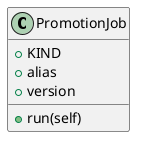

<!-- AUTOGENERATED_START -->
# src/regression_model_template/jobs/promotion.py

## Module Overview
Define a job for promoting a registered model version with an alias.

## Dependencies
- `typing`
- `regression_model_template.jobs`

## Public API
## Classes
### Class `PromotionJob`
Define a job for promoting a registered model version with an alias.

https://mlflow.org/docs/latest/model-registry.html#concepts

Parameters:
    alias (str): the mlflow alias to transition the registered model version.
    version (int | None): the model version to transition (use None for latest).
- **Bases:** None

#### Attributes
- `KIND`
- `alias`
- `version`

#### Methods
##### `run`
- **Arguments:** self
- **Returns:** base.Locals

## UML

<!-- AUTOGENERATED_END -->
