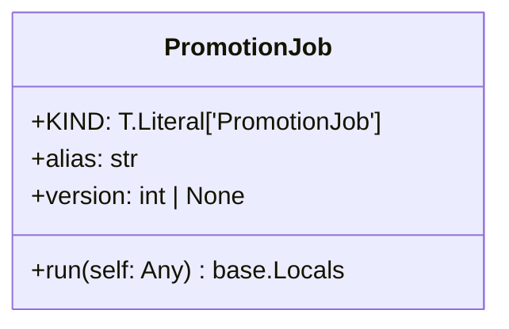
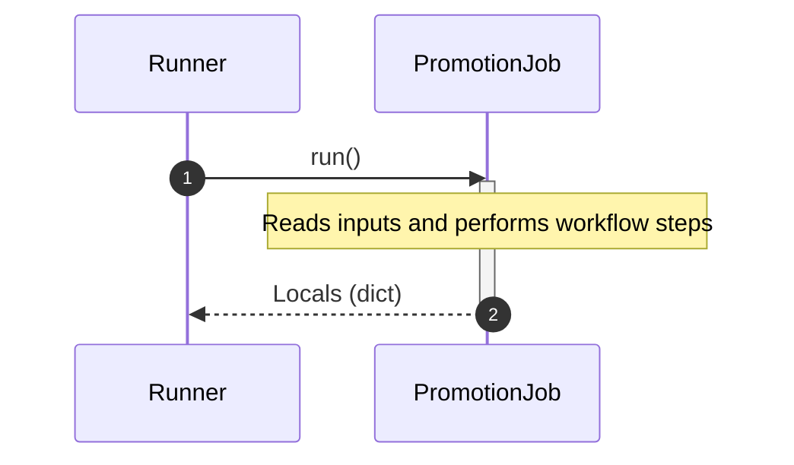

# Module Specification: promotion

* **Source Reference:** [src/regression_model_template/jobs/promotion.py](../../../src/regression_model_template/jobs/promotion.py) (Lines: L1-L57)

## 1. Architectural Role & Responsibilities
Define a job for promoting a registered model version with an alias.

## 2. UML 2.0 Class Diagram

## 2b. Execution Flow (Sequence Diagram)

## 3. Class & Method Specifications

### `PromotionJob` ([`src/regression_model_template/jobs/promotion.py:L12-L57`](../../../src/regression_model_template/jobs/promotion.py#L12-L57))

Define a job for promoting a registered model version with an alias.

https://mlflow.org/docs/latest/model-registry.html#concepts

Parameters:
    alias (str): the mlflow alias to transition the registered model version.
    version (int | None): the model version to transition (use None for latest).

#### Methods

* **`run(self: Any) -> base.Locals`** (L27-L57)
  - **Purpose**: No description available.
  - **Inputs**:
    - `self` (`Any`): Parameter description.
  - **Outputs**:
    - `base.Locals`: Return value description.
