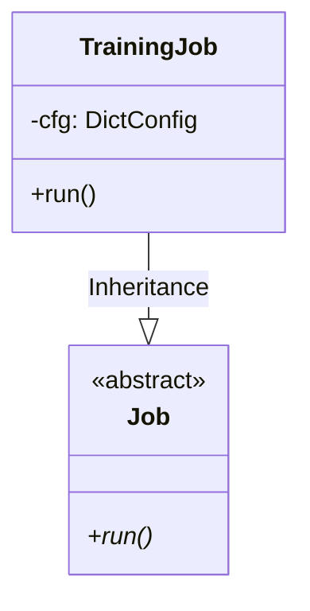

# Module Specification: Training Pipeline Job

* **Source File Reference:** `[[[[[src/regression_model_template/jobs/training.py](../../../../src/regression_model_template/jobs/training.py)](../../../../[src/regression_model_template/jobs/training.py](../../../../src/regression_model_template/jobs/training.py))](../../../../[[src/regression_model_template/jobs/training.py](../../../../src/regression_model_template/jobs/training.py)](../../../../[src/regression_model_template/jobs/training.py](../../../../src/regression_model_template/jobs/training.py)))](../../../../[[[src/regression_model_template/jobs/training.py](../../../../src/regression_model_template/jobs/training.py)](../../../../[src/regression_model_template/jobs/training.py](../../../../src/regression_model_template/jobs/training.py))](../../../../[[src/regression_model_template/jobs/training.py](../../../../src/regression_model_template/jobs/training.py)](../../../../[src/regression_model_template/jobs/training.py](../../../../src/regression_model_template/jobs/training.py))))](../../../../[[[[src/regression_model_template/jobs/training.py](../../../../src/regression_model_template/jobs/training.py)](../../../../[src/regression_model_template/jobs/training.py](../../../../src/regression_model_template/jobs/training.py))](../../../../[[src/regression_model_template/jobs/training.py](../../../../src/regression_model_template/jobs/training.py)](../../../../[src/regression_model_template/jobs/training.py](../../../../src/regression_model_template/jobs/training.py)))](../../../../[[[src/regression_model_template/jobs/training.py](../../../../src/regression_model_template/jobs/training.py)](../../../../[src/regression_model_template/jobs/training.py](../../../../src/regression_model_template/jobs/training.py))](../../../../[[src/regression_model_template/jobs/training.py](../../../../src/regression_model_template/jobs/training.py)](../../../../[src/regression_model_template/jobs/training.py](../../../../src/regression_model_template/jobs/training.py)))))` (Lines: L21-L145)
* **Upstream Dependencies:** [Modules/RegressionModelTemplate/Jobs/Base](base.md), [Modules/RegressionModelTemplate/Core/Models](../core/models.md), [Modules/RegressionModelTemplate/IO/Datasets](../io/datasets.md), [Modules/RegressionModelTemplate/IO/Registries](../io/registries.md)
* **Downstream Consumers:** [Modules/RegressionModelTemplate/Scripts](../scripts.md)

## 1. Architectural Role & Responsibilities
`TrainingJob` implements the complete model training lifecycle workflow. Reads raw feature datasets, performs Pandera schema validation, splits train/validation data, fits `BaselineSklearnModel`, evaluates regression metrics, logs artifacts to MLflow, and registers model candidates.

## 2. UML 2.0 Class Diagram

## 3. Class & Method Specifications

### `TrainingJob` (`[[[[[src/regression_model_template/jobs/training.py:L21-L145](../../../../src/regression_model_template/jobs/training.py#L21-L145)](../../../../[src/regression_model_template/jobs/training.py](../../../../src/regression_model_template/jobs/training.py)#L21-L145)](../../../../[[src/regression_model_template/jobs/training.py](../../../../src/regression_model_template/jobs/training.py)](../../../../[src/regression_model_template/jobs/training.py](../../../../src/regression_model_template/jobs/training.py))#L21-L145)](../../../../[[[src/regression_model_template/jobs/training.py](../../../../src/regression_model_template/jobs/training.py)](../../../../[src/regression_model_template/jobs/training.py](../../../../src/regression_model_template/jobs/training.py))](../../../../[[src/regression_model_template/jobs/training.py](../../../../src/regression_model_template/jobs/training.py)](../../../../[src/regression_model_template/jobs/training.py](../../../../src/regression_model_template/jobs/training.py)))#L21-L145)](../../../../[[[[src/regression_model_template/jobs/training.py](../../../../src/regression_model_template/jobs/training.py)](../../../../[src/regression_model_template/jobs/training.py](../../../../src/regression_model_template/jobs/training.py))](../../../../[[src/regression_model_template/jobs/training.py](../../../../src/regression_model_template/jobs/training.py)](../../../../[src/regression_model_template/jobs/training.py](../../../../src/regression_model_template/jobs/training.py)))](../../../../[[[src/regression_model_template/jobs/training.py](../../../../src/regression_model_template/jobs/training.py)](../../../../[src/regression_model_template/jobs/training.py](../../../../src/regression_model_template/jobs/training.py))](../../../../[[src/regression_model_template/jobs/training.py](../../../../src/regression_model_template/jobs/training.py)](../../../../[src/regression_model_template/jobs/training.py](../../../../src/regression_model_template/jobs/training.py))))#L21-L145)`)
* `run(self)` (L57-L145): Executes end-to-end training pipeline.
  1. Ingests train/test dataset splits via `ParquetReader`.
  2. Fits model instance on `X_train`, `y_train`.
  3. Predicts outputs for `X_val`.
  4. Calculates RMSE, MAE, R2 scores.
  5. Infers model signature (`InferSigner`) and saves artifact via `CustomSaver`.
