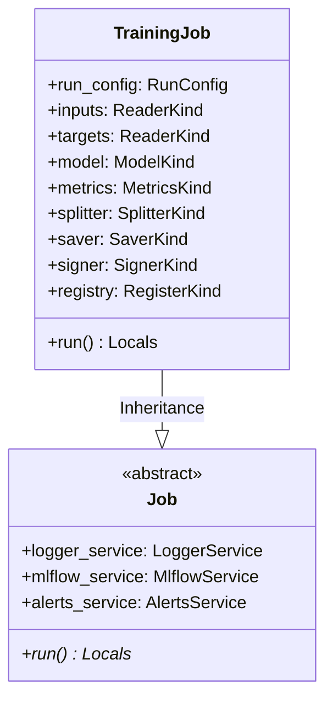

# Module Specification: Training Pipeline Job

* **Source File Reference:** [`src/regression_model_template/jobs/training.py`](/src/regression_model_template/jobs/training.py) (Lines: L21-L146)
* **Upstream Dependencies:** [Modules/RegressionModelTemplate/Jobs/Base](base.md), [Modules/RegressionModelTemplate/Core/Models](../core/models.md), [Modules/RegressionModelTemplate/IO/Datasets](../io/datasets.md), [Modules/RegressionModelTemplate/IO/Registries](../io/registries.md)
* **Downstream Consumers:** [Modules/RegressionModelTemplate/Scripts](../scripts.md)

## 1. Architectural Role & Responsibilities
`TrainingJob` implements the complete model training lifecycle workflow. Reads raw feature datasets, performs Pandera schema validation, splits train/validation data, fits `BaselineSklearnModel`, evaluates regression metrics, logs artifacts to MLflow, and registers model candidates.

## 2. UML 2.0 Class Diagram

## 3. Class & Method Specifications

### `TrainingJob` ([`src/regression_model_template/jobs/training.py:L21-L146`](/src/regression_model_template/jobs/training.py#L21-L146))

`TrainingJob` is a concrete execution job that fits a machine learning model candidate and registers it to the central MLflow registry. It encapsulates data ingestion, schema enforcement, dataset split logic, model training, evaluation score reporting, signing, saving, and registering within a managed MLflow run context.

#### Methods

* **`run(self) -> base.Locals`** (L57-L146)
  - **Purpose**: Executes the end-to-end model training, validation, and registration pipeline under a managed MLflow tracking run.
  - **Steps Executed**:
    1. Retrieves services (Logger, MLflow Client) and initializes a managed MLflow run context.
    2. Reads training features and ground truth targets from data reader connectors.
    3. Performs Pydantic/Pandera checks to enforce input and target schema contracts.
    4. Logs training dataset lineages to the active MLflow run.
    5. Splits features and targets into training and validation sets using the configured data splitter strategy.
    6. Fits the model estimator on the training set.
    7. Evaluates the fitted model on the validation set, calculates all configured metrics, and logs them in a single batch to MLflow.
    8. Infers input/output signatures and signs the model candidate.
    9. Saves the signed model candidate artifact to the designated store path.
    10. Registers the saved candidate to the MLflow model registry under the configured package registry name.
    11. Dispatches alerts notifications upon successful pipeline completion.
  - **Inputs**: None.
  - **Outputs**:
    - `base.Locals` (`dict`): Dictionary containing all local execution variables (including the final `model_version`).
