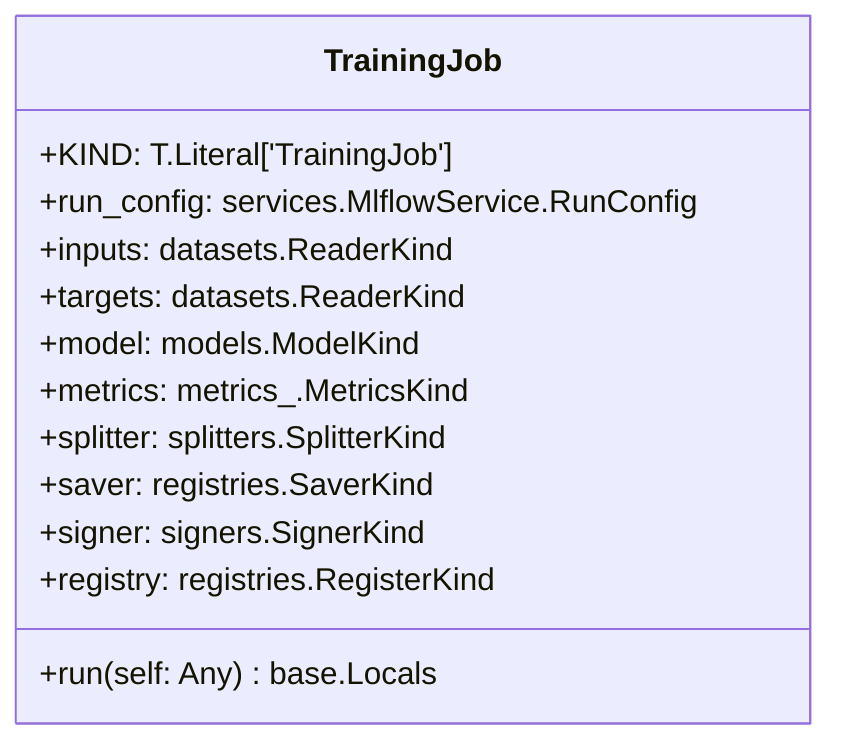
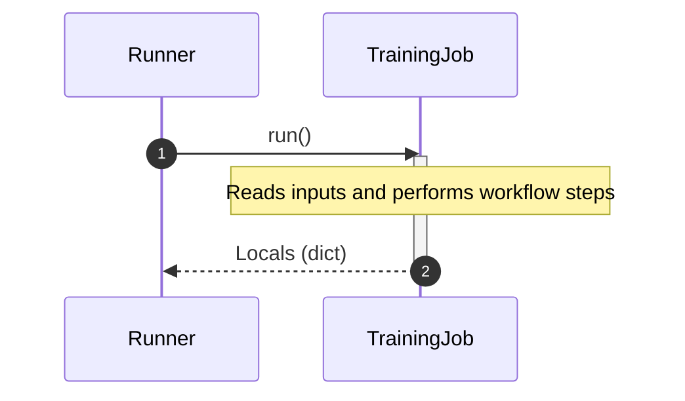

# Module Specification: training

* **Source Reference:** [src/regression_model_template/jobs/training.py](../../../src/regression_model_template/jobs/training.py) (Lines: L1-L145)

## 1. Architectural Role & Responsibilities
Define a job for training and registring a single AI/ML model.

## 2. UML 2.0 Class Diagram

## 2b. Execution Flow (Sequence Diagram)

## 3. Class & Method Specifications

### `TrainingJob` ([`src/regression_model_template/jobs/training.py:L21-L145`](../../../src/regression_model_template/jobs/training.py#L21-L145))

Train and register a single AI/ML model.

Parameters:
    run_config (services.MlflowService.RunConfig): mlflow run config.
    inputs (datasets.ReaderKind): reader for the inputs data.
    targets (datasets.ReaderKind): reader for the targets data.
    model (models.ModelKind): machine learning model to train.
    metrics (metrics_.MetricKind): metrics for the reporting.
    splitter (splitters.SplitterKind): data sets splitter.
    saver (registries.SaverKind): model saver.
    signer (signers.SignerKind): model signer.
    registry (registries.RegisterKind): model register.

#### Methods

* **`run(self: Any) -> base.Locals`** (L57-L145)
  - **Purpose**: No description available.
  - **Inputs**:
    - `self` (`Any`): Parameter description.
  - **Outputs**:
    - `base.Locals`: Return value description.
