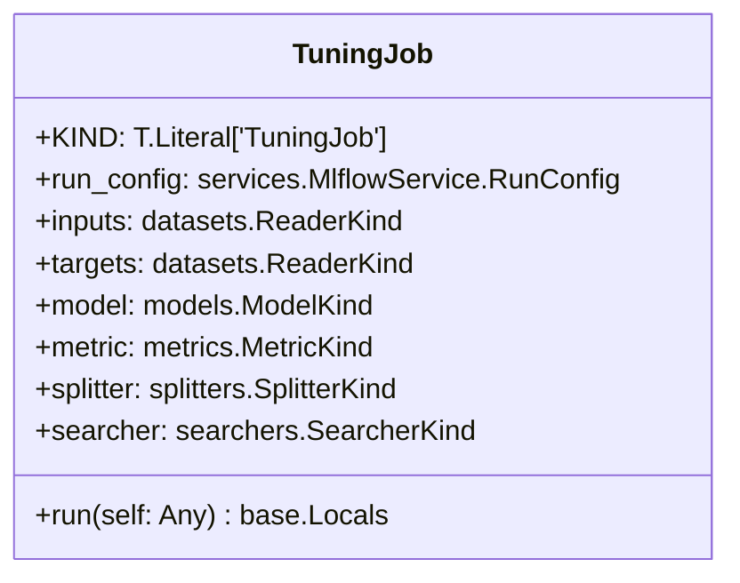
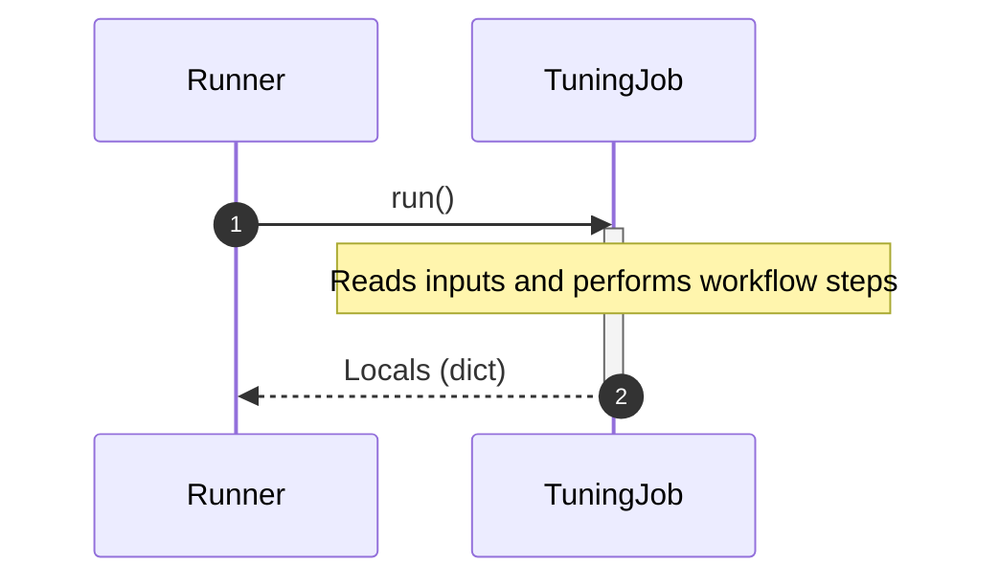

# Module Specification: tuning

* **Source Reference:** [src/regression_model_template/jobs/tuning.py](../../../src/regression_model_template/jobs/tuning.py) (Lines: L1-L104)

## 1. Architectural Role & Responsibilities
Define a job for finding the best hyperparameters for a model.

## 2. UML 2.0 Class Diagram

## 2b. Execution Flow (Sequence Diagram)

## 3. Class & Method Specifications

### `TuningJob` ([`src/regression_model_template/jobs/tuning.py:L18-L104`](../../../src/regression_model_template/jobs/tuning.py#L18-L104))

Find the best hyperparameters for a model.

Parameters:
    run_config (services.MlflowService.RunConfig): mlflow run config.
    inputs (datasets.ReaderKind): reader for the inputs data.
    targets (datasets.ReaderKind): reader for the targets data.
    model (models.ModelKind): machine learning model to tune.
    metric (metrics.MetricKind): tuning metric to optimize.
    splitter (splitters.SplitterKind): data sets splitter.
    searcher: (searchers.SearcherKind): hparams searcher.

#### Methods

* **`run(self: Any) -> base.Locals`** (L54-L104)
  - **Purpose**: Run the tuning job in context.
  - **Inputs**:
    - `self` (`Any`): Parameter description.
  - **Outputs**:
    - `base.Locals`: Return value description.
