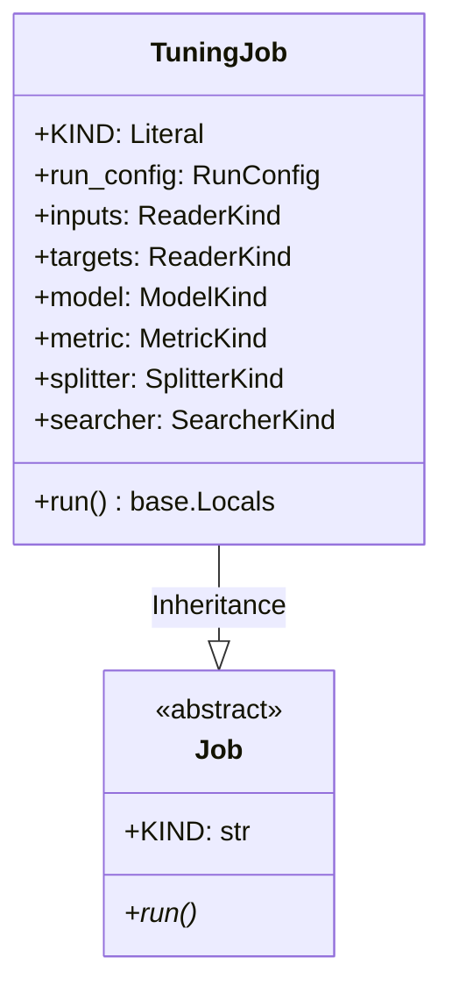

# Module Specification: Hyperparameter Tuning Job

* **Source File Reference:** [`src/regression_model_template/jobs/tuning.py`](/src/regression_model_template/jobs/tuning.py) (Lines: L18-L104)
* **Upstream Dependencies:** [Modules/RegressionModelTemplate/Jobs/Base](base.md), [Modules/RegressionModelTemplate/Utils/Searchers](../utils/searchers.md)
* **Downstream Consumers:** [Modules/RegressionModelTemplate/Scripts](../scripts.md)

## 1. Architectural Role & Responsibilities
`TuningJob` executes cross-validation hyperparameter optimization searches (`GridCVSearcher`), finding optimal parameter combinations and logging search trials to MLflow runs.

## 2. UML 2.0 Class Diagram

## 3. Class & Method Specifications

### `TuningJob` ([`src/regression_model_template/jobs/tuning.py:L18-L104`](/src/regression_model_template/jobs/tuning.py#L18-L104))
* `run(self)` (L54-L104): Executes hyperparameter optimization across grid search spaces, identifying best parameter set and logging performance metrics.
