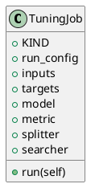

<!-- AUTOGENERATED_START -->
# src/regression_model_template/jobs/tuning.py

## Module Overview
Define a job for finding the best hyperparameters for a model.

## Dependencies
- `typing`
- `mlflow`
- `pydantic`
- `regression_model_template.core`
- `regression_model_template.io`
- `regression_model_template.jobs`
- `regression_model_template.utils`

## Public API
## Classes
### Class `TuningJob`
Find the best hyperparameters for a model.

Parameters:
    run_config (services.MlflowService.RunConfig): mlflow run config.
    inputs (datasets.ReaderKind): reader for the inputs data.
    targets (datasets.ReaderKind): reader for the targets data.
    model (models.ModelKind): machine learning model to tune.
    metric (metrics.MetricKind): tuning metric to optimize.
    splitter (splitters.SplitterKind): data sets splitter.
    searcher: (searchers.SearcherKind): hparams searcher.
- **Bases:** None

#### Attributes
- `KIND`
- `run_config`
- `inputs`
- `targets`
- `model`
- `metric`
- `splitter`
- `searcher`

#### Methods
##### `run`
Run the tuning job in context.
- **Arguments:** self
- **Returns:** base.Locals

## UML

<!-- AUTOGENERATED_END -->
