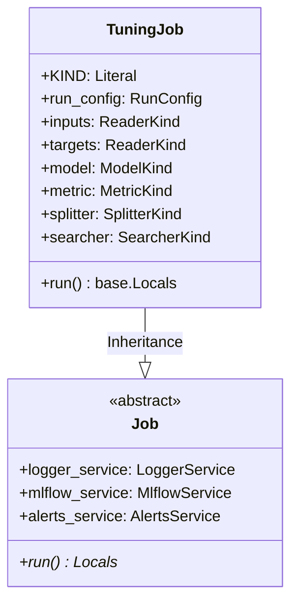

# Module Specification: Hyperparameter Tuning Job

* **Source File Reference:** [`src/regression_model_template/jobs/tuning.py`](/src/regression_model_template/jobs/tuning.py) (Lines: L18-L105)
* **Upstream Dependencies:** [Modules/RegressionModelTemplate/Jobs/Base](base.md), [Modules/RegressionModelTemplate/Utils/Searchers](../utils/searchers.md)
* **Downstream Consumers:** [Modules/RegressionModelTemplate/Scripts](../scripts.md)

## 1. Architectural Role & Responsibilities
`TuningJob` executes cross-validation hyperparameter optimization searches (`GridCVSearcher`), finding optimal parameter combinations and logging search trials to MLflow runs.

## 2. UML 2.0 Class Diagram

## 3. Class & Method Specifications

### `TuningJob` ([`src/regression_model_template/jobs/tuning.py:L18-L105`](/src/regression_model_template/jobs/tuning.py#L18-L105))

`TuningJob` is a concrete execution job that searches hyperparameter spaces using cross-validation over training datasets. It optimizes a single evaluation metric and records trial results.

#### Methods

* **`run(self) -> base.Locals`** (L54-L105)
  - **Purpose**: Runs hyperparameter tuning over the parameter grids. Reads input/target data, performs schema validation, tracks dataset lineages in MLflow, executes cross-validation hyperparameter searches, logs optimization parameters, and alerts on completion.
  - **Steps Executed**:
    1. Obtains the configured Logger and initializes an MLflow run context.
    2. Reads training features and targets dataframes.
    3. Performs Pydantic schema validation checks.
    4. Logs training dataset lineages (features and target columns) to the MLflow run.
    5. Calls the searcher instance's `search` method, passing the model, evaluation metric, datasets, and cross-validation data splitter.
    6. Extracts the optimization search grid dataframe, best performance score, and optimal hyperparameter dictionary.
    7. Sends completion alerts with the best parameter score.
  - **Inputs**: None.
  - **Outputs**:
    - `base.Locals` (`dict`): Dictionary containing all local variables (including the optimization `results`, `best_score`, and `best_params` dictionary).
