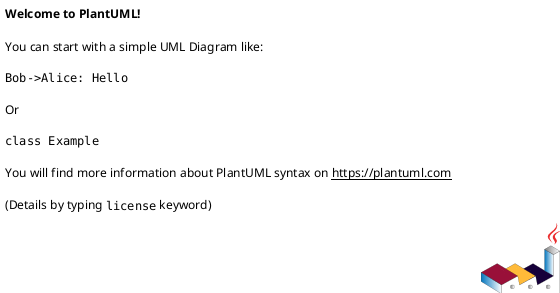

<!-- AUTOGENERATED_START -->
# src/regression_model_template/scripts.py

## Module Overview
Scripts for the CLI application.

## Dependencies
- `argparse`
- `json`
- `sys`
- `warnings`
- `regression_model_template`
- `regression_model_template.io`

## Public API
### Function `main`
Main script for the application.
- **Arguments:** argv
- **Returns:** int

## Classes
## UML

<!-- AUTOGENERATED_END -->
