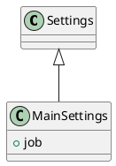

<!-- AUTOGENERATED_START -->
# src/regression_model_template/settings.py

## Module Overview
Define settings for the application.

## Dependencies
- `pydantic`
- `pydantic_settings`
- `regression_model_template`

## Public API
## Classes
### Class `Settings`
Base class for application settings.

Use settings to provide high-level preferences.
i.e., to separate settings from provider (e.g., CLI).
- **Bases:** None

#### Attributes
None

#### Methods
### Class `MainSettings`
Main settings of the application.

Parameters:
    job (jobs.JobKind): job to run.
- **Bases:** Settings

#### Attributes
- `job`

#### Methods
## UML

<!-- AUTOGENERATED_END -->
