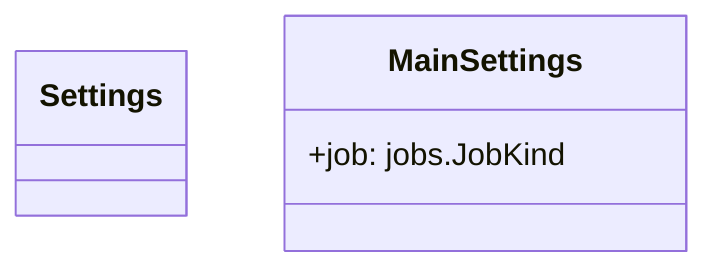

# Module Specification: settings

* **Source Reference:** [src/regression_model_template/settings.py](../../../src/regression_model_template/settings.py#L1-L28)
* **Upstream Dependencies:** [Modules/RegressionModelTemplate/IO/OSVariables](io/osvariables.md)
* **Downstream Consumers:** All jobs and controller services

## 1. Architectural Role & Responsibilities
Define settings for the application.

## 2. UML 2.0 Class Diagram

## 3. Class & Method Specifications

### `Settings` ([`src/regression_model_template/settings.py:L13-L18`](../../../src/regression_model_template/settings.py#L13-L18))

Base class for application settings.

Use settings to provide high-level preferences.
i.e., to separate settings from provider (e.g., CLI).

#### Methods

*No methods defined.*

### `MainSettings` ([`src/regression_model_template/settings.py:L21-L28`](../../../src/regression_model_template/settings.py#L21-L28))

Main settings of the application.

Parameters:
    job (jobs.JobKind): job to run.

#### Methods

*No methods defined.*
