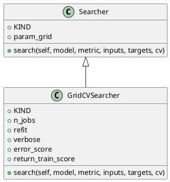

<!-- AUTOGENERATED_START -->
# src/regression_model_template/utils/searchers.py

## Module Overview
Find the best hyperparameters for a model.

## Dependencies
- `abc`
- `typing`
- `typing`
- `pandas`
- `pydantic`
- `sklearn`
- `regression_model_template.core`
- `regression_model_template.utils`

## Public API
## Classes
### Class `Searcher`
Base class for a searcher.

Use searcher to fine-tune models.
i.e., to find the best model params.

Parameters:
    param_grid (Grid): mapping of param key -> values.
- **Bases:** None

#### Attributes
- `KIND`
- `param_grid`

#### Methods
##### `search`
Search the best model for the given inputs and targets.

Args:
    model (models.Model): AI/ML model to fine-tune.
    metric (metrics.Metric): main metric to optimize.
    inputs (schemas.Inputs): model inputs for tuning.
    targets (schemas.Targets): model targets for tuning.
    cv (CrossValidation): choice for cross-fold validation.

Returns:
    Results: all the results of the searcher execution process.
- **Arguments:** self, model, metric, inputs, targets, cv
- **Returns:** Results

### Class `GridCVSearcher`
Grid searcher with cross-fold validation.

Convention: metric returns higher values for better models.

Parameters:
    n_jobs (int, optional): number of jobs to run in parallel.
    refit (bool): refit the model after the tuning.
    verbose (int): set the searcher verbosity level.
    error_score (str | float): strategy or value on error.
    return_train_score (bool): include train scores if True.
- **Bases:** Searcher

#### Attributes
- `KIND`
- `n_jobs`
- `refit`
- `verbose`
- `error_score`
- `return_train_score`

#### Methods
##### `search`
- **Arguments:** self, model, metric, inputs, targets, cv
- **Returns:** Results

## UML

<!-- AUTOGENERATED_END -->
