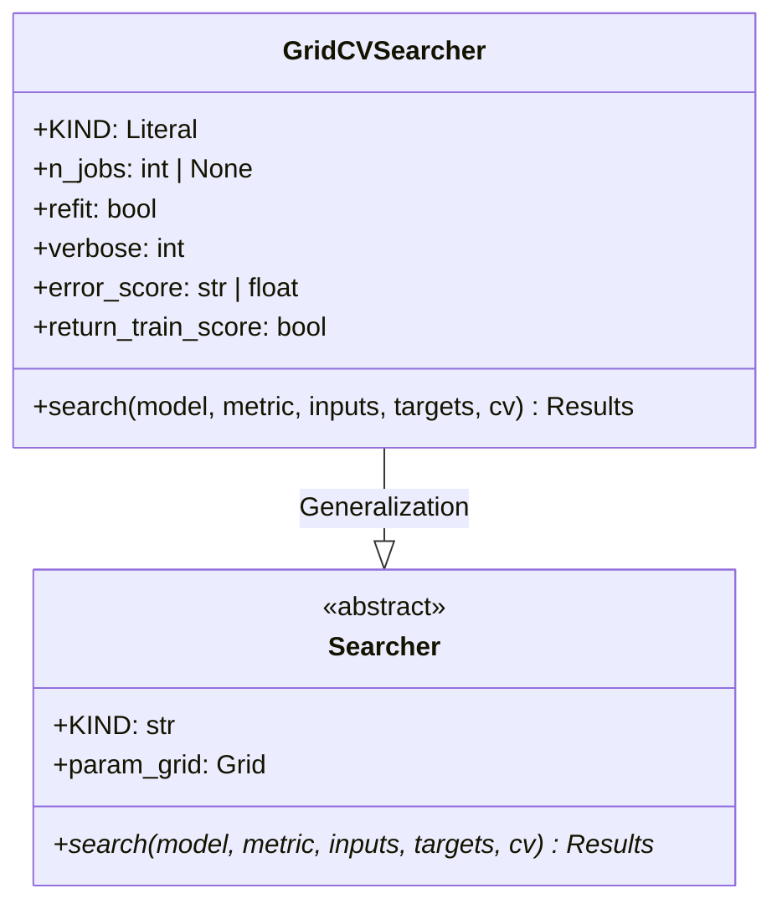

# Module Specification: Hyperparameter Searchers

* **Source File Reference:** [`src/regression_model_template/utils/searchers.py`](/src/regression_model_template/utils/searchers.py) (Lines: L34-L113)
* **Upstream Dependencies:** `scikit-learn`
* **Downstream Consumers:** [Modules/RegressionModelTemplate/Jobs/Tuning](../jobs/tuning.md)

## 1. Architectural Role & Responsibilities
`searchers.py` defines `Searcher` interface and `GridCVSearcher` implementation for cross-validated hyperparameter optimization.

## 2. UML 2.0 Class Diagram

## 3. Class & Method Specifications

### `Searcher` ([`src/regression_model_template/utils/searchers.py:L34-L68`](/src/regression_model_template/utils/searchers.py#L34-L68))
* `search(self, model, metric, inputs, targets, cv)` (L49-L68): Abstract cross-validation search method.

### `GridCVSearcher` ([`src/regression_model_template/utils/searchers.py:L71-L113`](/src/regression_model_template/utils/searchers.py#L71-L113))
* `search(self, model, metric, inputs, targets, cv)` (L92-L113): Executes Scikit-Learn `GridSearchCV` optimization across defined parameter grids.
