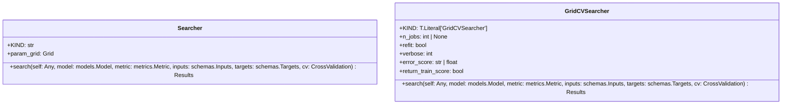

# Module Specification: searchers

* **Source Reference:** [src/regression_model_template/utils/searchers.py](../../../src/regression_model_template/utils/searchers.py) (Lines: L1-L116)

## 1. Architectural Role & Responsibilities
Find the best hyperparameters for a model.

## 2. UML 2.0 Class Diagram

## 3. Class & Method Specifications

### `Searcher` ([`src/regression_model_template/utils/searchers.py:L34-L68`](../../../src/regression_model_template/utils/searchers.py#L34-L68))

Base class for a searcher.

Use searcher to fine-tune models.
i.e., to find the best model params.

Parameters:
    param_grid (Grid): mapping of param key -> values.

#### Methods

* **`search(self: Any, model: models.Model, metric: metrics.Metric, inputs: schemas.Inputs, targets: schemas.Targets, cv: CrossValidation) -> Results`** (L49-L68)
  - **Purpose**: Search the best model for the given inputs and targets.
  - **Inputs**:
    - `self` (`Any`): Parameter description.
    - `model` (`models.Model`): Parameter description.
    - `metric` (`metrics.Metric`): Parameter description.
    - `inputs` (`schemas.Inputs`): Parameter description.
    - `targets` (`schemas.Targets`): Parameter description.
    - `cv` (`CrossValidation`): Parameter description.
  - **Outputs**:
    - `Results`: Return value description.

### `GridCVSearcher` ([`src/regression_model_template/utils/searchers.py:L71-L113`](../../../src/regression_model_template/utils/searchers.py#L71-L113))

Grid searcher with cross-fold validation.

Convention: metric returns higher values for better models.

Parameters:
    n_jobs (int, optional): number of jobs to run in parallel.
    refit (bool): refit the model after the tuning.
    verbose (int): set the searcher verbosity level.
    error_score (str | float): strategy or value on error.
    return_train_score (bool): include train scores if True.

#### Methods

* **`search(self: Any, model: models.Model, metric: metrics.Metric, inputs: schemas.Inputs, targets: schemas.Targets, cv: CrossValidation) -> Results`** (L92-L113)
  - **Purpose**: No description available.
  - **Inputs**:
    - `self` (`Any`): Parameter description.
    - `model` (`models.Model`): Parameter description.
    - `metric` (`metrics.Metric`): Parameter description.
    - `inputs` (`schemas.Inputs`): Parameter description.
    - `targets` (`schemas.Targets`): Parameter description.
    - `cv` (`CrossValidation`): Parameter description.
  - **Outputs**:
    - `Results`: Return value description.
