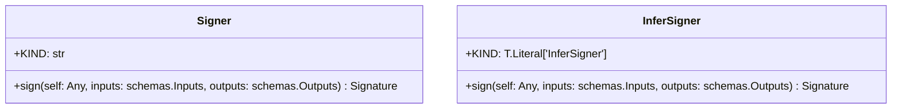

# Module Specification: signers

* **Source Reference:** [src/regression_model_template/utils/signers.py](../../../src/regression_model_template/utils/signers.py) (Lines: L1-L54)

## 1. Architectural Role & Responsibilities
Generate signatures for AI/ML models.

## 2. UML 2.0 Class Diagram

## 3. Class & Method Specifications

### `Signer` ([`src/regression_model_template/utils/signers.py:L21-L42`](../../../src/regression_model_template/utils/signers.py#L21-L42))

Base class for generating model signatures.

Allow to switch between model signing strategies.
e.g., automatic inference, manual model signature, ...

https://mlflow.org/docs/latest/models.html#model-signature-and-input-example

#### Methods

* **`sign(self: Any, inputs: schemas.Inputs, outputs: schemas.Outputs) -> Signature`** (L33-L42)
  - **Purpose**: Generate a model signature from its inputs/outputs.
  - **Inputs**:
    - `self` (`Any`): Parameter description.
    - `inputs` (`schemas.Inputs`): Parameter description.
    - `outputs` (`schemas.Outputs`): Parameter description.
  - **Outputs**:
    - `Signature`: Return value description.

### `InferSigner` ([`src/regression_model_template/utils/signers.py:L45-L51`](../../../src/regression_model_template/utils/signers.py#L45-L51))

Generate model signatures from inputs/outputs data.

#### Methods

* **`sign(self: Any, inputs: schemas.Inputs, outputs: schemas.Outputs) -> Signature`** (L50-L51)
  - **Purpose**: No description available.
  - **Inputs**:
    - `self` (`Any`): Parameter description.
    - `inputs` (`schemas.Inputs`): Parameter description.
    - `outputs` (`schemas.Outputs`): Parameter description.
  - **Outputs**:
    - `Signature`: Return value description.
