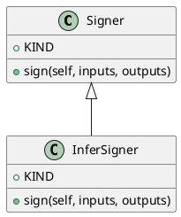

<!-- AUTOGENERATED_START -->
# src/regression_model_template/utils/signers.py

## Module Overview
Generate signatures for AI/ML models.

## Dependencies
- `abc`
- `typing`
- `mlflow`
- `pydantic`
- `mlflow.models`
- `regression_model_template.core`

## Public API
## Classes
### Class `Signer`
Base class for generating model signatures.

Allow to switch between model signing strategies.
e.g., automatic inference, manual model signature, ...

https://mlflow.org/docs/latest/models.html#model-signature-and-input-example
- **Bases:** None

#### Attributes
- `KIND`

#### Methods
##### `sign`
Generate a model signature from its inputs/outputs.

Args:
    inputs (schemas.Inputs): inputs data.
    outputs (schemas.Outputs): outputs data.

Returns:
    Signature: signature of the model.
- **Arguments:** self, inputs, outputs
- **Returns:** Signature

### Class `InferSigner`
Generate model signatures from inputs/outputs data.
- **Bases:** Signer

#### Attributes
- `KIND`

#### Methods
##### `sign`
- **Arguments:** self, inputs, outputs
- **Returns:** Signature

## UML

<!-- AUTOGENERATED_END -->
