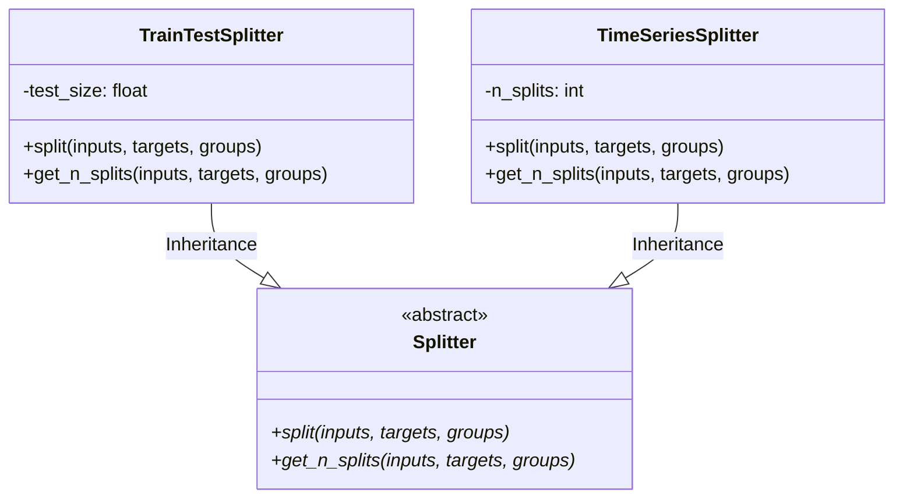

# Module Specification: Dataset Splitters

* **Source File Reference:** `src/regression_model_template/utils/splitters.py` (Lines: L24-L108)
* **Upstream Dependencies:** `scikit-learn`
* **Downstream Consumers:** [[Modules/RegressionModelTemplate/Jobs/Training]], [[Modules/RegressionModelTemplate/Jobs/Tuning]]

## 1. Architectural Role & Responsibilities
`splitters.py` defines `Splitter` abstraction, implementing `TrainTestSplitter` (randomized train/test partitioning) and `TimeSeriesSplitter` (temporal sequence cross-validation partitioning).

## 2. UML 2.0 Class Diagram

## 3. Class Specifications

### `Splitter` (`src/regression_model_template/utils/splitters.py:L24-L59`)
* `split(self, inputs, targets, groups)` (L36-L46): Abstract split generator.
* `get_n_splits(self, inputs, targets, groups)` (L49-L59): Abstract split count retriever.

### `TrainTestSplitter` (`src/regression_model_template/utils/splitters.py:L62-L85`)
* Performs standard train/test split partitioning.

### `TimeSeriesSplitter` (`src/regression_model_template/utils/splitters.py:L88-L108`)
* Performs expanding-window temporal cross-validation splits.
