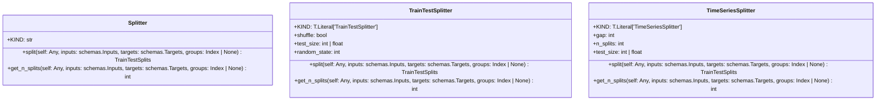

# Module Specification: splitters

* **Source Reference:** [src/regression_model_template/utils/splitters.py](../../../src/regression_model_template/utils/splitters.py) (Lines: L1-L111)

## 1. Architectural Role & Responsibilities
Split dataframes into subsets (e.g., train/valid/test).

## 2. UML 2.0 Class Diagram

## 3. Class & Method Specifications

### `Splitter` ([`src/regression_model_template/utils/splitters.py:L24-L59`](../../../src/regression_model_template/utils/splitters.py#L24-L59))

Base class for a splitter.

Use splitters to split data in sets.
e.g., split between a train/test subsets.

# https://scikit-learn.org/stable/glossary.html#term-CV-splitter

#### Methods

* **`split(self: Any, inputs: schemas.Inputs, targets: schemas.Targets, groups: Index | None) -> TrainTestSplits`** (L36-L46)
  - **Purpose**: Split a dataframe into subsets.
  - **Inputs**:
    - `self` (`Any`): Parameter description.
    - `inputs` (`schemas.Inputs`): Parameter description.
    - `targets` (`schemas.Targets`): Parameter description.
    - `groups` (`Index | None`): Parameter description.
  - **Outputs**:
    - `TrainTestSplits`: Return value description.

* **`get_n_splits(self: Any, inputs: schemas.Inputs, targets: schemas.Targets, groups: Index | None) -> int`** (L49-L59)
  - **Purpose**: Get the number of splits generated.
  - **Inputs**:
    - `self` (`Any`): Parameter description.
    - `inputs` (`schemas.Inputs`): Parameter description.
    - `targets` (`schemas.Targets`): Parameter description.
    - `groups` (`Index | None`): Parameter description.
  - **Outputs**:
    - `int`: Return value description.

### `TrainTestSplitter` ([`src/regression_model_template/utils/splitters.py:L62-L85`](../../../src/regression_model_template/utils/splitters.py#L62-L85))

Split a dataframe into a train and test set.

Parameters:
    shuffle (bool): shuffle the dataset. Default is False.
    test_size (int | float): number/ratio for the test set.
    random_state (int): random state for the splitter object.

#### Methods

* **`split(self: Any, inputs: schemas.Inputs, targets: schemas.Targets, groups: Index | None) -> TrainTestSplits`** (L77-L82)
  - **Purpose**: No description available.
  - **Inputs**:
    - `self` (`Any`): Parameter description.
    - `inputs` (`schemas.Inputs`): Parameter description.
    - `targets` (`schemas.Targets`): Parameter description.
    - `groups` (`Index | None`): Parameter description.
  - **Outputs**:
    - `TrainTestSplits`: Return value description.

* **`get_n_splits(self: Any, inputs: schemas.Inputs, targets: schemas.Targets, groups: Index | None) -> int`** (L84-L85)
  - **Purpose**: No description available.
  - **Inputs**:
    - `self` (`Any`): Parameter description.
    - `inputs` (`schemas.Inputs`): Parameter description.
    - `targets` (`schemas.Targets`): Parameter description.
    - `groups` (`Index | None`): Parameter description.
  - **Outputs**:
    - `int`: Return value description.

### `TimeSeriesSplitter` ([`src/regression_model_template/utils/splitters.py:L88-L108`](../../../src/regression_model_template/utils/splitters.py#L88-L108))

Split a dataframe into fixed time series subsets.

Parameters:
    gap (int): gap between splits.
    n_splits (int): number of split to generate.
    test_size (int | float): number or ratio for the test dataset.

#### Methods

* **`split(self: Any, inputs: schemas.Inputs, targets: schemas.Targets, groups: Index | None) -> TrainTestSplits`** (L103-L105)
  - **Purpose**: No description available.
  - **Inputs**:
    - `self` (`Any`): Parameter description.
    - `inputs` (`schemas.Inputs`): Parameter description.
    - `targets` (`schemas.Targets`): Parameter description.
    - `groups` (`Index | None`): Parameter description.
  - **Outputs**:
    - `TrainTestSplits`: Return value description.

* **`get_n_splits(self: Any, inputs: schemas.Inputs, targets: schemas.Targets, groups: Index | None) -> int`** (L107-L108)
  - **Purpose**: No description available.
  - **Inputs**:
    - `self` (`Any`): Parameter description.
    - `inputs` (`schemas.Inputs`): Parameter description.
    - `targets` (`schemas.Targets`): Parameter description.
    - `groups` (`Index | None`): Parameter description.
  - **Outputs**:
    - `int`: Return value description.
