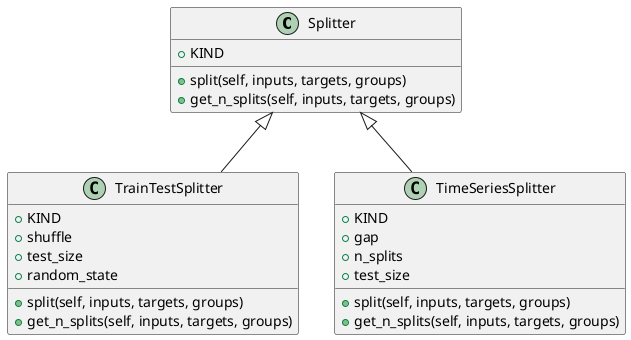

<!-- AUTOGENERATED_START -->
# src/regression_model_template/utils/splitters.py

## Module Overview
Split dataframes into subsets (e.g., train/valid/test).

## Dependencies
- `abc`
- `typing`
- `numpy`
- `numpy.typing`
- `pydantic`
- `sklearn`
- `regression_model_template.core`

## Public API
## Classes
### Class `Splitter`
Base class for a splitter.

Use splitters to split data in sets.
e.g., split between a train/test subsets.

# https://scikit-learn.org/stable/glossary.html#term-CV-splitter
- **Bases:** None

#### Attributes
- `KIND`

#### Methods
##### `split`
Split a dataframe into subsets.

Args:
    inputs (schemas.Inputs): model inputs.
    targets (schemas.Targets): model targets.
    groups (Index | None, optional): group labels.

Returns:
    TrainTestSplits: iterator over the dataframe train/test splits.
- **Arguments:** self, inputs, targets, groups
- **Returns:** TrainTestSplits

##### `get_n_splits`
Get the number of splits generated.

Args:
    inputs (schemas.Inputs): models inputs.
    targets (schemas.Targets): model targets.
    groups (Index | None, optional): group labels.

Returns:
    int: number of splits generated.
- **Arguments:** self, inputs, targets, groups
- **Returns:** int

### Class `TrainTestSplitter`
Split a dataframe into a train and test set.

Parameters:
    shuffle (bool): shuffle the dataset. Default is False.
    test_size (int | float): number/ratio for the test set.
    random_state (int): random state for the splitter object.
- **Bases:** Splitter

#### Attributes
- `KIND`
- `shuffle`
- `test_size`
- `random_state`

#### Methods
##### `split`
- **Arguments:** self, inputs, targets, groups
- **Returns:** TrainTestSplits

##### `get_n_splits`
- **Arguments:** self, inputs, targets, groups
- **Returns:** int

### Class `TimeSeriesSplitter`
Split a dataframe into fixed time series subsets.

Parameters:
    gap (int): gap between splits.
    n_splits (int): number of split to generate.
    test_size (int | float): number or ratio for the test dataset.
- **Bases:** Splitter

#### Attributes
- `KIND`
- `gap`
- `n_splits`
- `test_size`

#### Methods
##### `split`
- **Arguments:** self, inputs, targets, groups
- **Returns:** TrainTestSplits

##### `get_n_splits`
- **Arguments:** self, inputs, targets, groups
- **Returns:** int

## UML

<!-- AUTOGENERATED_END -->
