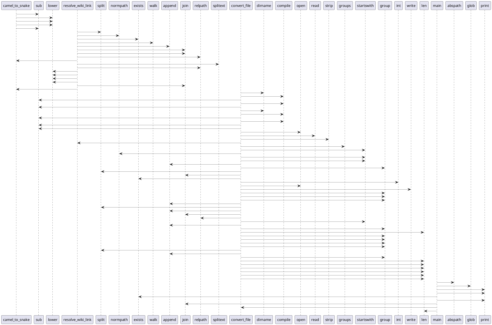

# Module: `skills/validate/scripts/convert_links.py`

## Overview
**Purpose**: Module providing various functionalities.

**Architecture Role**: Infrastructure

**Dependencies**:
- `re`
- `glob`
- `os`

**Exported Symbols**:
- `camel_to_snake`
- `resolve_wiki_link`
- `convert_file`
- `main`

## UML Class Diagram

## Call Graph

## Classes
## Functions
### Function `camel_to_snake`
- **Description**: No description available.
- **Inputs**:
  - `name`: Any
- **Output**: `Any`
- **Side Effects**: Not documented
- **Complexity**: Not documented

### Function `resolve_wiki_link`
- **Description**: No description available.
- **Inputs**:
  - `link_content`: Any
  - `current_file_dir`: Any
  - `wiki_root`: Any
- **Output**: `Any`
- **Side Effects**: Not documented
- **Complexity**: Not documented

### Function `convert_file`
- **Description**: No description available.
- **Inputs**:
  - `file_path`: Any
  - `wiki_root`: Any
- **Output**: `Any`
- **Side Effects**: Not documented
- **Complexity**: Not documented

### Function `main`
- **Description**: No description available.
- **Inputs**:
- **Output**: `Any`
- **Side Effects**: Not documented
- **Complexity**: Not documented
