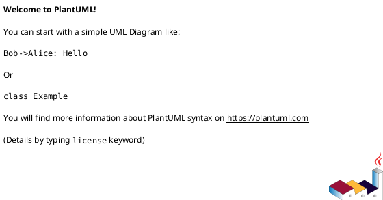
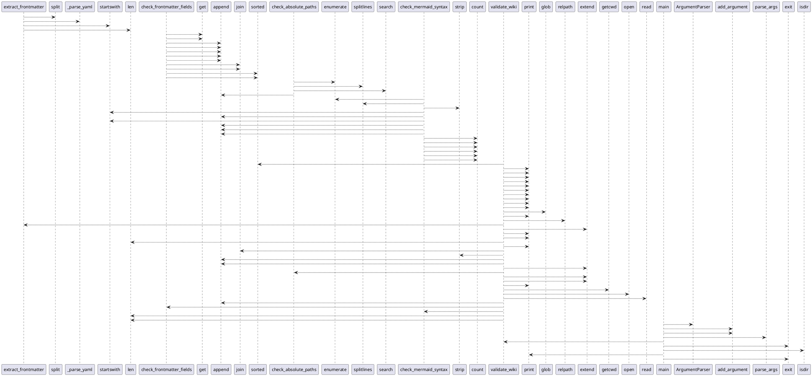

# Module: `skills/validate/scripts/okf_validate.py`

## Overview
**Purpose**: OKF v0.2 Conformance Checker for OpenWiki Documentation.

**Architecture Role**: Infrastructure

**Dependencies**:
- `sys`
- `typing`
- `re`
- `glob`
- `os`
- `argparse`

**Exported Symbols**:
- `extract_frontmatter`
- `check_frontmatter_fields`
- `check_absolute_paths`
- `check_mermaid_syntax`
- `validate_wiki`
- `main`

## UML Class Diagram

## Call Graph

## Classes
## Functions
### Function `extract_frontmatter`
- **Description**: Split YAML frontmatter from Markdown body.
- **Inputs**:
  - `content`: str
- **Output**: `tuple[dict[str, Any], str]`
- **Side Effects**: Not documented
- **Complexity**: Not documented

### Function `check_frontmatter_fields`
- **Description**: Validate required and optional frontmatter fields.
- **Inputs**:
  - `fm`: dict[str, Any]
  - `filepath`: str
  - `strict`: bool
- **Output**: `list[str]`
- **Side Effects**: Not documented
- **Complexity**: Not documented

### Function `check_absolute_paths`
- **Description**: Detect absolute file paths in the document body.
- **Inputs**:
  - `body`: str
  - `filepath`: str
- **Output**: `list[str]`
- **Side Effects**: Not documented
- **Complexity**: Not documented

### Function `check_mermaid_syntax`
- **Description**: Basic structural validation of Mermaid code blocks.
- **Inputs**:
  - `body`: str
  - `filepath`: str
- **Output**: `list[str]`
- **Side Effects**: Not documented
- **Complexity**: Not documented

### Function `validate_wiki`
- **Description**: Validate all .md files under wiki_path. Returns error count.
- **Inputs**:
  - `wiki_path`: str
  - `strict`: bool
- **Output**: `int`
- **Side Effects**: Not documented
- **Complexity**: Not documented

### Function `main`
- **Description**: No description available.
- **Inputs**:
- **Output**: `None`
- **Side Effects**: Not documented
- **Complexity**: Not documented
