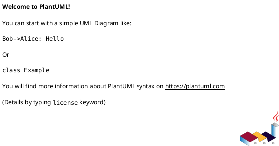

# Module: `src/regression_model_template/__main__.py`

## Overview
**Purpose**: Entry point of the package.

**Architecture Role**: Domain Models

**Dependencies**:
- `regression_model_template`

**Exported Symbols**:

## UML Class Diagram

## Call Graph

## Classes
## Functions
