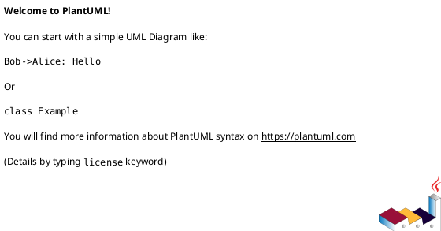

# Module: `src/regression_model_template/controller/__init__.py`

## Overview
**Purpose**: Predict the number of regression_model_template available.

**Architecture Role**: Controllers

**Dependencies**:

**Exported Symbols**:

## UML Class Diagram

## Call Graph

## Classes
## Functions
