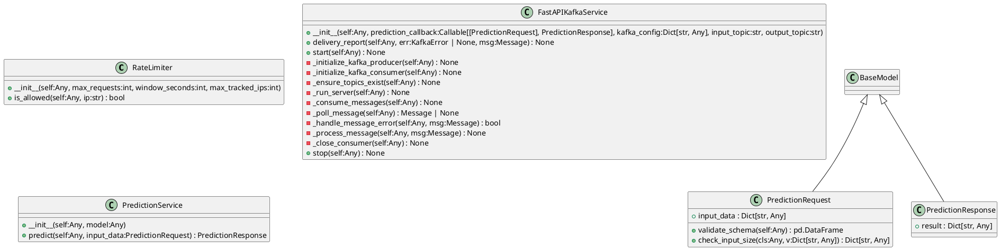

# Module: `src/regression_model_template/controller/kafka_app.py`

## Overview
**Purpose**: FastAPI and Kafka Service for Predictions with Logging.

**Architecture Role**: Controllers

**Dependencies**:
- `fastapi.middleware.cors`
- `regression_model_template.io`
- `time`
- `confluent_kafka`
- `pydantic`
- `regression_model_template.io.registries`
- `json`
- `threading`
- `collections`
- `fastapi`
- `fastapi.concurrency`
- `logging`
- `pandas`
- `regression_model_template.core.schemas`
- `confluent_kafka.admin`
- `typing`
- `uvicorn.middleware.proxy_headers`
- `uvicorn`
- `fastapi.middleware.trustedhost`
- `os`

**Exported Symbols**:
- `RateLimiter`
- `default_input_payload`
- `PredictionRequest`
- `PredictionResponse`
- `FastAPIKafkaService`
- `PredictionService`
- `main`

## UML Class Diagram

## Call Graph

```plantuml
@startuml
default_input_payload --> strftime
default_input_payload --> now
default_input_payload --> weekday
default_input_payload --> now
main --> MlflowService
main --> start
main --> uri_for_model_alias_or_version
main --> CustomLoader
main --> load
main --> PredictionService
main --> FastAPIKafkaService
main --> start
main --> print
RateLimiter::is_allowed --> time
RateLimiter::is_allowed --> move_to_end
RateLimiter::is_allowed --> append
RateLimiter::is_allowed --> deque
RateLimiter::is_allowed --> popleft
RateLimiter::is_allowed --> len
RateLimiter::is_allowed --> len
RateLimiter::is_allowed --> popitem
PredictionRequest::validate_schema --> validate
PredictionRequest::validate_schema --> DataFrame
PredictionRequest::check_input_size --> field_validator
PredictionRequest::check_input_size --> values
PredictionRequest::check_input_size --> ValueError
PredictionRequest::check_input_size --> len
PredictionRequest::check_input_size --> ValueError
PredictionRequest::check_input_size --> len
PredictionRequest::check_input_size --> isinstance
PredictionRequest::check_input_size --> ValueError
PredictionRequest::check_input_size --> ValueError
FastAPIKafkaService::delivery_report --> error
FastAPIKafkaService::delivery_report --> info
FastAPIKafkaService::delivery_report --> topic
FastAPIKafkaService::delivery_report --> partition
FastAPIKafkaService::start --> clear
FastAPIKafkaService::start --> _initialize_kafka_producer
FastAPIKafkaService::start --> _initialize_kafka_consumer
FastAPIKafkaService::start --> Thread
FastAPIKafkaService::start --> start
FastAPIKafkaService::start --> start
FastAPIKafkaService::start --> info
FastAPIKafkaService::start --> Thread
FastAPIKafkaService::_initialize_kafka_producer --> Producer
FastAPIKafkaService::_initialize_kafka_producer --> info
FastAPIKafkaService::_initialize_kafka_producer --> error
FastAPIKafkaService::_initialize_kafka_producer --> items
FastAPIKafkaService::_initialize_kafka_consumer --> _ensure_topics_exist
FastAPIKafkaService::_initialize_kafka_consumer --> Consumer
FastAPIKafkaService::_initialize_kafka_consumer --> subscribe
FastAPIKafkaService::_initialize_kafka_consumer --> info
FastAPIKafkaService::_initialize_kafka_consumer --> error
FastAPIKafkaService::_ensure_topics_exist --> AdminClient
FastAPIKafkaService::_ensure_topics_exist --> create_topics
FastAPIKafkaService::_ensure_topics_exist --> items
FastAPIKafkaService::_ensure_topics_exist --> NewTopic
FastAPIKafkaService::_ensure_topics_exist --> NewTopic
FastAPIKafkaService::_ensure_topics_exist --> warning
FastAPIKafkaService::_ensure_topics_exist --> items
FastAPIKafkaService::_ensure_topics_exist --> result
FastAPIKafkaService::_ensure_topics_exist --> info
FastAPIKafkaService::_ensure_topics_exist --> debug
FastAPIKafkaService::_run_server --> run
FastAPIKafkaService::_run_server --> error
FastAPIKafkaService::_consume_messages --> _close_consumer
FastAPIKafkaService::_consume_messages --> is_set
FastAPIKafkaService::_consume_messages --> _poll_message
FastAPIKafkaService::_consume_messages --> error
FastAPIKafkaService::_consume_messages --> _process_message
FastAPIKafkaService::_consume_messages --> info
FastAPIKafkaService::_consume_messages --> flush
FastAPIKafkaService::_consume_messages --> _handle_message_error
FastAPIKafkaService::_poll_message --> poll
FastAPIKafkaService::_poll_message --> error
FastAPIKafkaService::_handle_message_error --> error
FastAPIKafkaService::_handle_message_error --> code
FastAPIKafkaService::_handle_message_error --> error
FastAPIKafkaService::_handle_message_error --> code
FastAPIKafkaService::_handle_message_error --> debug
FastAPIKafkaService::_handle_message_error --> warning
FastAPIKafkaService::_process_message --> PredictionResponse
FastAPIKafkaService::_process_message --> value
FastAPIKafkaService::_process_message --> loads
FastAPIKafkaService::_process_message --> debug
FastAPIKafkaService::_process_message --> PredictionRequest
FastAPIKafkaService::_process_message --> debug
FastAPIKafkaService::_process_message --> error
FastAPIKafkaService::_process_message --> decode
FastAPIKafkaService::_process_message --> get
FastAPIKafkaService::_process_message --> len
FastAPIKafkaService::_process_message --> info
FastAPIKafkaService::_process_message --> prediction_callback
FastAPIKafkaService::_process_message --> exception
FastAPIKafkaService::_process_message --> isinstance
FastAPIKafkaService::_process_message --> copy
FastAPIKafkaService::_process_message --> isinstance
FastAPIKafkaService::_process_message --> produce
FastAPIKafkaService::_process_message --> poll
FastAPIKafkaService::_process_message --> error
FastAPIKafkaService::_process_message --> commit
FastAPIKafkaService::_process_message --> exception
FastAPIKafkaService::_process_message --> len
FastAPIKafkaService::_process_message --> info
FastAPIKafkaService::_process_message --> next
FastAPIKafkaService::_process_message --> dumps
FastAPIKafkaService::_process_message --> iter
FastAPIKafkaService::_process_message --> len
FastAPIKafkaService::_process_message --> values
FastAPIKafkaService::_close_consumer --> info
FastAPIKafkaService::_close_consumer --> close
FastAPIKafkaService::stop --> set
FastAPIKafkaService::stop --> info
FastAPIKafkaService::stop --> close
FastAPIKafkaService::stop --> info
PredictionService::predict --> PredictionResponse
PredictionService::predict --> predict
PredictionService::predict --> tolist
PredictionService::predict --> exception
PredictionService::predict --> check
PredictionService::predict --> to_numpy
PredictionService::predict --> DataFrame
@enduml
```

## Classes
### Class `RateLimiter`
**Overview**: In-memory sliding window rate limiter backed by OrderedDict.

#### Constructor
- `self` (Any)
- `max_requests` (int)
- `window_seconds` (int)
- `max_tracked_ips` (int)
#### Public Methods
##### `is_allowed`
- **Description**: Check if the given IP is allowed to make a request.
- **Inputs**:
  - `self`: Any
  - `ip`: str
- **Output**: `bool`
- **Side Effects**: Not documented
- **Complexity**: Not documented

#### Private Methods
### Class `PredictionRequest`
**Overview**: Request model for prediction.

#### Attributes
- `input_data`: Dict[str, Any]
#### Public Methods
##### `validate_schema`
- **Description**: Validates the input data against InputsSchema.
- **Inputs**:
  - `self`: Any
- **Output**: `pd.DataFrame`
- **Side Effects**: Not documented
- **Complexity**: Not documented

##### `check_input_size`
- **Description**: Check if the input data size is within limits.
- **Inputs**:
  - `cls`: Any
  - `v`: Dict[str, Any]
- **Output**: `Dict[str, Any]`
- **Side Effects**: Not documented
- **Complexity**: Not documented

#### Private Methods
### Class `PredictionResponse`
**Overview**: Response model for prediction.

#### Attributes
- `result`: Dict[str, Any]
#### Public Methods
#### Private Methods
### Class `FastAPIKafkaService`
**Overview**: Service for deploying a FastAPI application with a Kafka producer and consumer.

#### Constructor
- `self` (Any)
- `prediction_callback` (Callable[[PredictionRequest], PredictionResponse])
- `kafka_config` (Dict[str, Any])
- `input_topic` (str)
- `output_topic` (str)
#### Public Methods
##### `delivery_report`
- **Description**: Called once for each message produced to indicate delivery result.
- **Inputs**:
  - `self`: Any
  - `err`: KafkaError | None
  - `msg`: Message
- **Output**: `None`
- **Side Effects**: Not documented
- **Complexity**: Not documented

##### `start`
- **Description**: Start the FastAPI application and Kafka consumer.
- **Inputs**:
  - `self`: Any
- **Output**: `None`
- **Side Effects**: Not documented
- **Complexity**: Not documented

##### `stop`
- **Description**: Stop the FastAPI application and Kafka consumer.
- **Inputs**:
  - `self`: Any
- **Output**: `None`
- **Side Effects**: Not documented
- **Complexity**: Not documented

#### Private Methods
##### `_initialize_kafka_producer`
- **Purpose**: Initialize Kafka producer.
- **Parameters**: self
- **Return**: `None`

##### `_initialize_kafka_consumer`
- **Purpose**: Initialize Kafka consumer.
- **Parameters**: self
- **Return**: `None`

##### `_ensure_topics_exist`
- **Purpose**: Ensure input and output Kafka topics exist on the broker.
- **Parameters**: self
- **Return**: `None`

##### `_run_server`
- **Purpose**: Run the FastAPI server.
- **Parameters**: self
- **Return**: `None`

##### `_consume_messages`
- **Purpose**: Consume messages from Kafka topic and produce predictions.
- **Parameters**: self
- **Return**: `None`

##### `_poll_message`
- **Purpose**: Poll message from Kafka consumer.
- **Parameters**: self
- **Return**: `Message | None`

##### `_handle_message_error`
- **Purpose**: Handle errors in polled messages.
- **Parameters**: self, msg
- **Return**: `bool`

##### `_process_message`
- **Purpose**: Process a valid Kafka message.
- **Parameters**: self, msg
- **Return**: `None`

##### `_close_consumer`
- **Purpose**: Close the Kafka consumer.
- **Parameters**: self
- **Return**: `None`

### Class `PredictionService`
**Overview**: Service to handle prediction logic securely.

#### Constructor
- `self` (Any)
- `model` (Any)
#### Public Methods
##### `predict`
- **Description**: Make a prediction using the model.
- **Inputs**:
  - `self`: Any
  - `input_data`: PredictionRequest
- **Output**: `PredictionResponse`
- **Side Effects**: Not documented
- **Complexity**: Not documented

#### Private Methods
## Functions
### Function `default_input_payload`
- **Description**: Generate a fresh default input payload with current timestamps.
- **Inputs**:
- **Output**: `Dict[str, Any]`
- **Side Effects**: Not documented
- **Complexity**: Not documented

### Function `main`
- **Description**: No description available.
- **Inputs**:
- **Output**: `None`
- **Side Effects**: Not documented
- **Complexity**: Not documented
