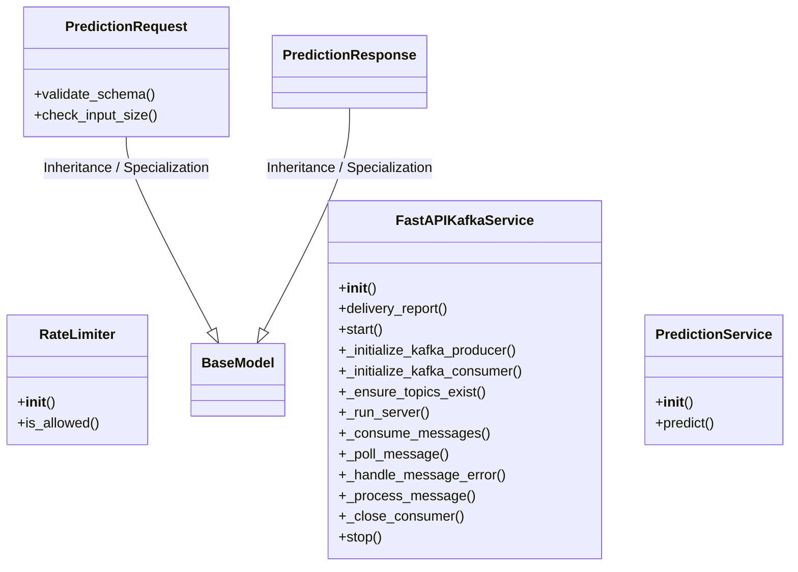
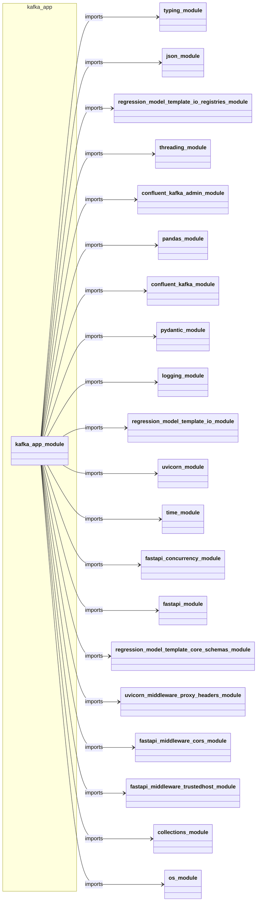
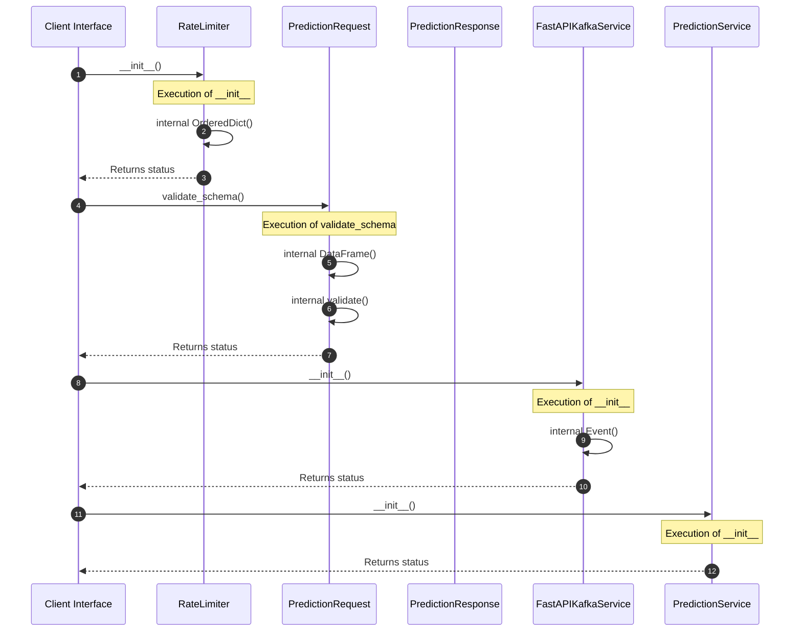

# Module Name: kafka_app

* **Source Directory Reference:** `src/regression_model_template/controller/`
* **Package Dependency:** Upstream: `typing`, `json`, `regression_model_template.io.registries`, `threading`, `confluent_kafka.admin`, `pandas`, `confluent_kafka`, `pydantic`, `logging`, `regression_model_template.io`, `uvicorn`, `time`, `fastapi.concurrency`, `fastapi`, `regression_model_template.core.schemas`, `uvicorn.middleware.proxy_headers`, `fastapi.middleware.cors`, `fastapi.middleware.trustedhost`, `collections`, `os` | Downstream: None

## 1. Executive Summary & Purpose
Deterministic architectural model extracted via AST parsing for module `kafka_app`.

## 2. UML 2.0 Class & Inheritance Architecture (Deterministic)
The following class diagram models the object-oriented structure, explicit inheritance hierarchies, and polymorphic interface implementations derived from local AST analysis:

## 3. Package & Class Relations

The following diagram defines the package boundaries and directional inter-package dependencies:

* **Inheritance & Polymorphism:** Detailed breakdown of abstract base classes, interfaces, and concrete overrides.
* **Dependencies:** How classes within this package collaborate externally.

## 4. Execution Flow & Runtime Behavior

The following sequence diagram outlines the execution lifecycle and message passing during core operations:

---

* **Source Citations:**
  - Class `RateLimiter`: `src/regression_model_template/controller/kafka_app.py:82`
  - Method `__init__`: `src/regression_model_template/controller/kafka_app.py:85`
  - Method `is_allowed`: `src/regression_model_template/controller/kafka_app.py:91`
  - Class `PredictionRequest`: `src/regression_model_template/controller/kafka_app.py:138`
  - Method `validate_schema`: `src/regression_model_template/controller/kafka_app.py:143`
  - Method `check_input_size`: `src/regression_model_template/controller/kafka_app.py:149`
  - Class `PredictionResponse`: `src/regression_model_template/controller/kafka_app.py:177`
  - Class `FastAPIKafkaService`: `src/regression_model_template/controller/kafka_app.py:184`
  - Method `__init__`: `src/regression_model_template/controller/kafka_app.py:187`
  - Method `delivery_report`: `src/regression_model_template/controller/kafka_app.py:203`
  - Method `start`: `src/regression_model_template/controller/kafka_app.py:210`
  - Method `_initialize_kafka_producer`: `src/regression_model_template/controller/kafka_app.py:220`
  - Method `_initialize_kafka_consumer`: `src/regression_model_template/controller/kafka_app.py:232`
  - Method `_ensure_topics_exist`: `src/regression_model_template/controller/kafka_app.py:244`
  - Method `_run_server`: `src/regression_model_template/controller/kafka_app.py:264`
  - Method `_consume_messages`: `src/regression_model_template/controller/kafka_app.py:271`
  - Method `_poll_message`: `src/regression_model_template/controller/kafka_app.py:287`
  - Method `_handle_message_error`: `src/regression_model_template/controller/kafka_app.py:295`
  - Method `_process_message`: `src/regression_model_template/controller/kafka_app.py:320`
  - Method `_close_consumer`: `src/regression_model_template/controller/kafka_app.py:374`
  - Method `stop`: `src/regression_model_template/controller/kafka_app.py:380`
  - Class `PredictionService`: `src/regression_model_template/controller/kafka_app.py:442`
  - Method `__init__`: `src/regression_model_template/controller/kafka_app.py:445`
  - Method `predict`: `src/regression_model_template/controller/kafka_app.py:448`
