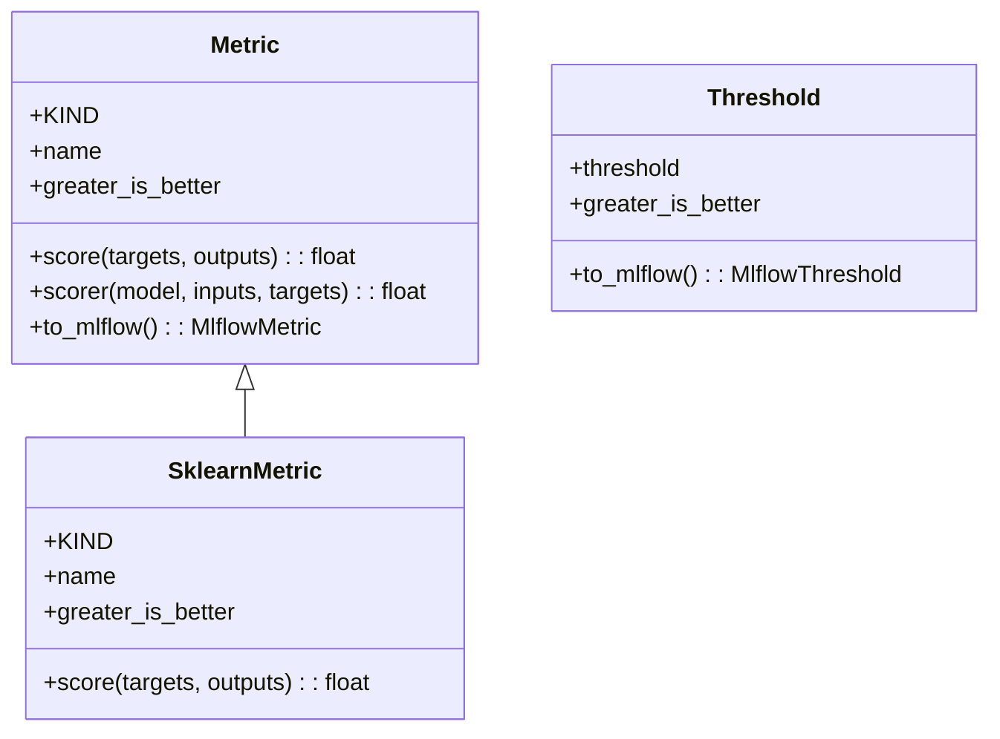
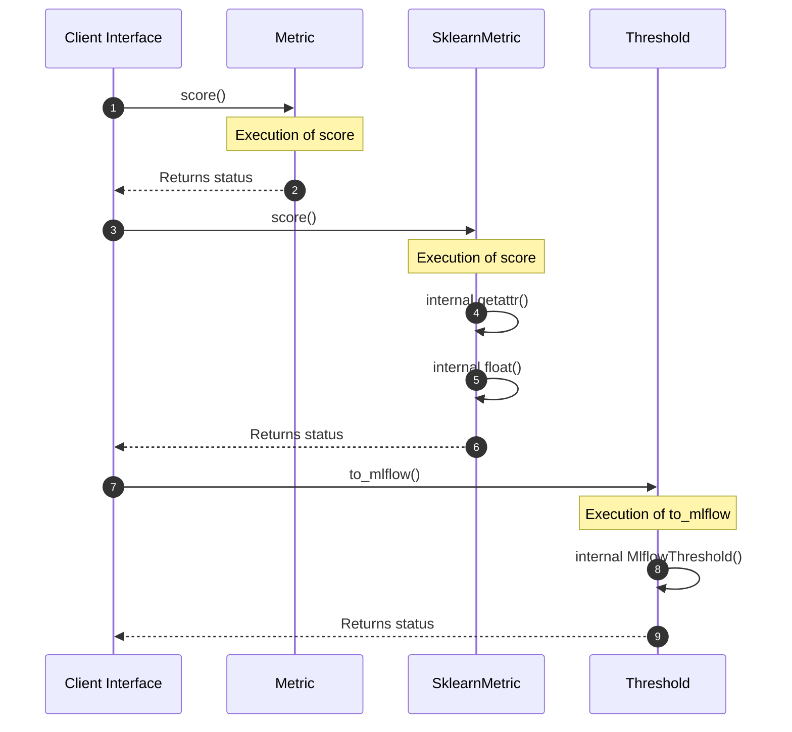
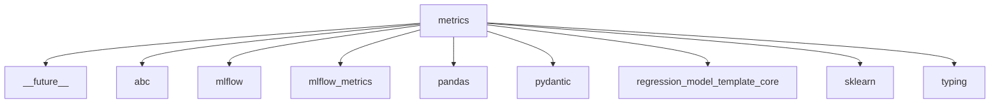

# Module Name: metrics

Source File: `src/regression_model_template/core/metrics.py`
* **Source Directory Reference:** `src/regression_model_template/core/`
* **Package Dependency:** Upstream: `sklearn`, `pydantic`, `mlflow`, `__future__`, `abc`, `pandas`, `mlflow.metrics`, `typing`, `regression_model_template.core` | Downstream: None

## 1. Executive Summary & Purpose
Deterministic architectural model extracted via AST parsing for module `metrics`.

## 2. UML 2.0 Class & Inheritance Architecture (Deterministic)
The following class diagram models the object-oriented structure, explicit inheritance hierarchies, and polymorphic interface implementations derived from local AST analysis:

## 3. Package & Class Relations

The following diagram defines the package boundaries and directional inter-package dependencies:

* **Inheritance & Polymorphism:** Detailed breakdown of abstract base classes, interfaces, and concrete overrides.
* **Dependencies:** How classes within this package collaborate externally.

## 4. Execution Flow & Runtime Behavior

The following sequence diagram outlines the execution lifecycle and message passing during core operations:

---

* **Source Citations:**
  - Class `Metric`: `src/regression_model_template/core/metrics.py:27`
  - Method `score`: `src/regression_model_template/core/metrics.py:44`
  - Method `scorer`: `src/regression_model_template/core/metrics.py:55`
  - Method `to_mlflow`: `src/regression_model_template/core/metrics.py:70`
  - Class `SklearnMetric`: `src/regression_model_template/core/metrics.py:98`
  - Method `score`: `src/regression_model_template/core/metrics.py:111`
  - Class `Threshold`: `src/regression_model_template/core/metrics.py:126`
  - Method `to_mlflow`: `src/regression_model_template/core/metrics.py:140`

