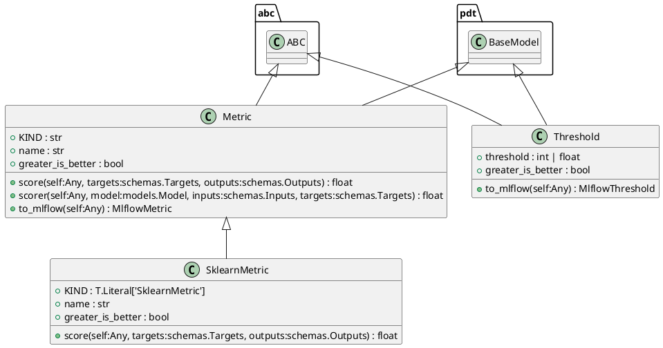
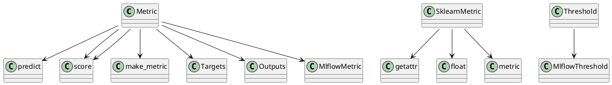

# Module: `src/regression_model_template/core/metrics.py`

## Overview
**Purpose**: Evaluate model performances with metrics.

**Architecture Role**: Domain Models

**Dependencies**:
- `sklearn`
- `pydantic`
- `regression_model_template.core`
- `typing`
- `abc`
- `mlflow`
- `pandas`
- `__future__`
- `mlflow.metrics`

**Exported Symbols**:
- `Metric`
- `SklearnMetric`
- `Threshold`

## UML Class Diagram

## Call Graph

## Classes
### Class `Metric`
**Overview**: Base class for a project metric.

Use metrics to evaluate model performance.
e.g., accuracy, precision, recall, MAE, F1, ...

Parameters:
    name (str): name of the metric for the reporting.
    greater_is_better (bool): maximize or minimize result.

#### Attributes
- `KIND`: str
- `name`: str
- `greater_is_better`: bool
#### Public Methods
##### `score`
- **Description**: Score the outputs against the targets.

Args:
    targets (schemas.Targets): expected values.
    outputs (schemas.Outputs): predicted values.

Returns:
    float: single result from the metric computation.
- **Inputs**:
  - `self`: Any
  - `targets`: schemas.Targets
  - `outputs`: schemas.Outputs
- **Output**: `float`
- **Side Effects**: Not documented
- **Complexity**: Not documented

##### `scorer`
- **Description**: Score model outputs against targets.

Args:
    model (models.Model): model to evaluate.
    inputs (schemas.Inputs): model inputs values.
    targets (schemas.Targets): model expected values.

Returns:
    float: single result from the metric computation.
- **Inputs**:
  - `self`: Any
  - `model`: models.Model
  - `inputs`: schemas.Inputs
  - `targets`: schemas.Targets
- **Output**: `float`
- **Side Effects**: Not documented
- **Complexity**: Not documented

##### `to_mlflow`
- **Description**: Convert the metric to an Mlflow metric.

Returns:
    MlflowMetric: the Mlflow metric.
- **Inputs**:
  - `self`: Any
- **Output**: `MlflowMetric`
- **Side Effects**: Not documented
- **Complexity**: Not documented

#### Private Methods
### Class `SklearnMetric`
**Overview**: Compute metrics with sklearn.

Parameters:
    name (str): name of the sklearn metric.
    greater_is_better (bool): maximize or minimize.

#### Attributes
- `KIND`: T.Literal['SklearnMetric']
- `name`: str
- `greater_is_better`: bool
#### Public Methods
##### `score`
- **Description**: No description available.
- **Inputs**:
  - `self`: Any
  - `targets`: schemas.Targets
  - `outputs`: schemas.Outputs
- **Output**: `float`
- **Side Effects**: Not documented
- **Complexity**: Not documented

#### Private Methods
### Class `Threshold`
**Overview**: A project threshold for a metric.

Use thresholds to monitor model performances.
e.g., to trigger an alert when a threshold is met.

Parameters:
    threshold (int | float): absolute threshold value.
    greater_is_better (bool): maximize or minimize result.

#### Attributes
- `threshold`: int | float
- `greater_is_better`: bool
#### Public Methods
##### `to_mlflow`
- **Description**: Convert the threshold to an mlflow threshold.

Returns:
    MlflowThreshold: the mlflow threshold.
- **Inputs**:
  - `self`: Any
- **Output**: `MlflowThreshold`
- **Side Effects**: Not documented
- **Complexity**: Not documented

#### Private Methods
## Functions
