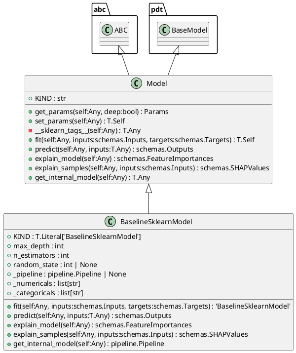

# Module: `src/regression_model_template/core/models.py`

## Overview
**Purpose**: Define trainable machine learning models.

**Architecture Role**: Domain Models

**Dependencies**:
- `sklearn`
- `pydantic`
- `typing`
- `abc`
- `shap`
- `regression_model_template.core`

**Exported Symbols**:
- `Model`
- `BaselineSklearnModel`

## UML Class Diagram

## Call Graph

```plantuml
@startuml
Model::get_params --> items
Model::get_params --> model_dump
Model::get_params --> startswith
Model::get_params --> isupper
Model::set_params --> items
Model::set_params --> setattr
Model::__sklearn_tags__ --> __sklearn_tags__
Model::__sklearn_tags__ --> BaseEstimator
Model::explain_model --> NotImplementedError
Model::explain_samples --> NotImplementedError
Model::get_internal_model --> NotImplementedError
BaselineSklearnModel::fit --> OneHotEncoder
BaselineSklearnModel::fit --> ColumnTransformer
BaselineSklearnModel::fit --> RandomForestRegressor
BaselineSklearnModel::fit --> Pipeline
BaselineSklearnModel::fit --> fit
BaselineSklearnModel::predict --> get_internal_model
BaselineSklearnModel::predict --> predict
BaselineSklearnModel::predict --> Outputs
BaselineSklearnModel::explain_model --> get_internal_model
BaselineSklearnModel::explain_model --> get_feature_names_out
BaselineSklearnModel::explain_model --> FeatureImportances
BaselineSklearnModel::explain_samples --> get_internal_model
BaselineSklearnModel::explain_samples --> transform
BaselineSklearnModel::explain_samples --> TreeExplainer
BaselineSklearnModel::explain_samples --> SHAPValues
BaselineSklearnModel::explain_samples --> shap_values
BaselineSklearnModel::explain_samples --> get_feature_names_out
BaselineSklearnModel::get_internal_model --> ValueError
@enduml
```

## Classes
### Class `Model`
**Overview**: Base class for a project model.

Use a model to adapt AI/ML frameworks.
e.g., to swap easily one model with another.

#### Attributes
- `KIND`: str
#### Public Methods
##### `get_params`
- **Description**: Get the model params.

Args:
    deep (bool, optional): ignored.

Returns:
    Params: internal model parameters.
- **Inputs**:
  - `self`: Any
  - `deep`: bool
- **Output**: `Params`
- **Side Effects**: Not documented
- **Complexity**: Not documented

##### `set_params`
- **Description**: Set the model params in place.

Returns:
    T.Self: instance of the model.
- **Inputs**:
  - `self`: Any
- **Output**: `T.Self`
- **Side Effects**: Not documented
- **Complexity**: Not documented

##### `fit`
- **Description**: Fit the model on the given inputs and targets.

Args:
    inputs (schemas.Inputs): model training inputs.
    targets (schemas.Targets): model training targets.

Returns:
    T.Self: instance of the model.
- **Inputs**:
  - `self`: Any
  - `inputs`: schemas.Inputs
  - `targets`: schemas.Targets
- **Output**: `T.Self`
- **Side Effects**: Not documented
- **Complexity**: Not documented

##### `predict`
- **Description**: Generate outputs with the model for the given inputs.

Args:
    inputs (schemas.Inputs): model prediction inputs.

Returns:
    schemas.Outputs: model prediction outputs.
- **Inputs**:
  - `self`: Any
  - `inputs`: T.Any
- **Output**: `schemas.Outputs`
- **Side Effects**: Not documented
- **Complexity**: Not documented

##### `explain_model`
- **Description**: Explain the internal model structure.

Raises:
    NotImplementedError: method not implemented.

Returns:
    schemas.FeatureImportances: feature importances.
- **Inputs**:
  - `self`: Any
- **Output**: `schemas.FeatureImportances`
- **Side Effects**: Not documented
- **Complexity**: Not documented

##### `explain_samples`
- **Description**: Explain model outputs on input samples.

Raises:
    NotImplementedError: method not implemented.

Returns:
    schemas.SHAPValues: SHAP values.
- **Inputs**:
  - `self`: Any
  - `inputs`: schemas.Inputs
- **Output**: `schemas.SHAPValues`
- **Side Effects**: Not documented
- **Complexity**: Not documented

##### `get_internal_model`
- **Description**: Return the internal model in the object.

Raises:
    NotImplementedError: method not implemented.

Returns:
    T.Any: any internal model (either empty or fitted).
- **Inputs**:
  - `self`: Any
- **Output**: `T.Any`
- **Side Effects**: Not documented
- **Complexity**: Not documented

#### Private Methods
##### `__sklearn_tags__`
- **Purpose**: Get the model tags for scikit-learn.

Returns:
    T.Any: model tags.
- **Parameters**: self
- **Return**: `T.Any`

### Class `BaselineSklearnModel`
**Overview**: Simple baseline model based on scikit-learn.

Parameters:
    max_depth (int): maximum depth of the random forest.
    n_estimators (int): number of estimators in the random forest.
    random_state (int, optional): random state of the machine learning pipeline.

#### Attributes
- `KIND`: T.Literal['BaselineSklearnModel']
- `max_depth`: int
- `n_estimators`: int
- `random_state`: int | None
- `_pipeline`: pipeline.Pipeline | None
- `_numericals`: list[str]
- `_categoricals`: list[str]
#### Public Methods
##### `fit`
- **Description**: No description available.
- **Inputs**:
  - `self`: Any
  - `inputs`: schemas.Inputs
  - `targets`: schemas.Targets
- **Output**: `'BaselineSklearnModel'`
- **Side Effects**: Not documented
- **Complexity**: Not documented

##### `predict`
- **Description**: No description available.
- **Inputs**:
  - `self`: Any
  - `inputs`: T.Any
- **Output**: `schemas.Outputs`
- **Side Effects**: Not documented
- **Complexity**: Not documented

##### `explain_model`
- **Description**: No description available.
- **Inputs**:
  - `self`: Any
- **Output**: `schemas.FeatureImportances`
- **Side Effects**: Not documented
- **Complexity**: Not documented

##### `explain_samples`
- **Description**: No description available.
- **Inputs**:
  - `self`: Any
  - `inputs`: schemas.Inputs
- **Output**: `schemas.SHAPValues`
- **Side Effects**: Not documented
- **Complexity**: Not documented

##### `get_internal_model`
- **Description**: No description available.
- **Inputs**:
  - `self`: Any
- **Output**: `pipeline.Pipeline`
- **Side Effects**: Not documented
- **Complexity**: Not documented

#### Private Methods
## Functions
