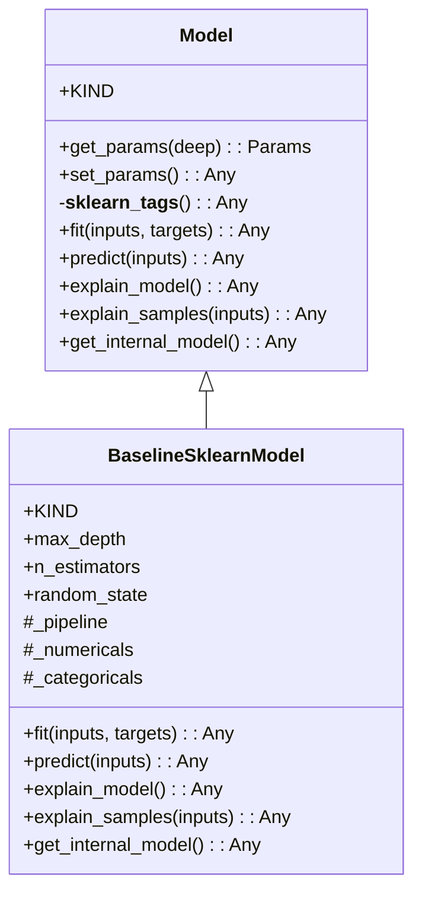
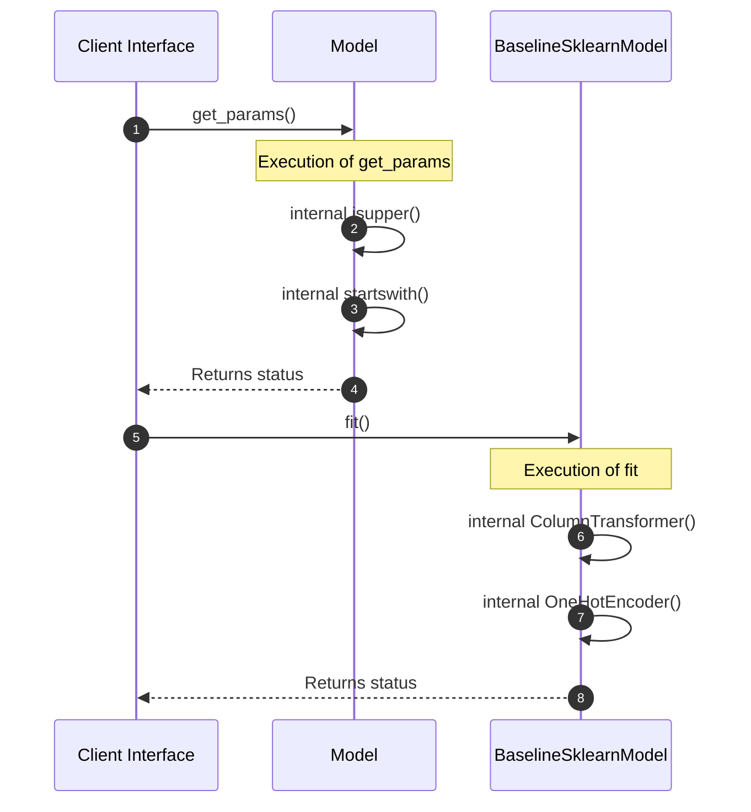
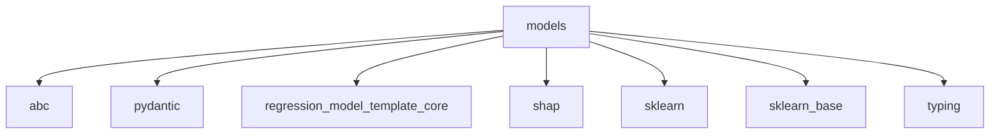

# Module Name: models

Source File: `src/regression_model_template/core/models.py`
* **Source Directory Reference:** `src/regression_model_template/core/`
* **Package Dependency:** Upstream: `sklearn`, `pydantic`, `abc`, `shap`, `typing`, `regression_model_template.core`, `sklearn.base` | Downstream: None

## 1. Executive Summary & Purpose
Deterministic architectural model extracted via AST parsing for module `models`.

## 2. UML 2.0 Class & Inheritance Architecture (Deterministic)
The following class diagram models the object-oriented structure, explicit inheritance hierarchies, and polymorphic interface implementations derived from local AST analysis:

## 3. Package & Class Relations

The following diagram defines the package boundaries and directional inter-package dependencies:

* **Inheritance & Polymorphism:** Detailed breakdown of abstract base classes, interfaces, and concrete overrides.
* **Dependencies:** How classes within this package collaborate externally.

## 4. Execution Flow & Runtime Behavior

The following sequence diagram outlines the execution lifecycle and message passing during core operations:

---

* **Source Citations:**
  - Class `Model`: `src/regression_model_template/core/models.py:24`
  - Method `get_params`: `src/regression_model_template/core/models.py:33`
  - Method `set_params`: `src/regression_model_template/core/models.py:48`
  - Method `__sklearn_tags__`: `src/regression_model_template/core/models.py:58`
  - Method `fit`: `src/regression_model_template/core/models.py:69`
  - Method `predict`: `src/regression_model_template/core/models.py:81`
  - Method `explain_model`: `src/regression_model_template/core/models.py:91`
  - Method `explain_samples`: `src/regression_model_template/core/models.py:102`
  - Method `get_internal_model`: `src/regression_model_template/core/models.py:113`
  - Class `BaselineSklearnModel`: `src/regression_model_template/core/models.py:125`
  - Method `fit`: `src/regression_model_template/core/models.py:161`
  - Method `predict`: `src/regression_model_template/core/models.py:185`
  - Method `explain_model`: `src/regression_model_template/core/models.py:191`
  - Method `explain_samples`: `src/regression_model_template/core/models.py:204`
  - Method `get_internal_model`: `src/regression_model_template/core/models.py:216`

