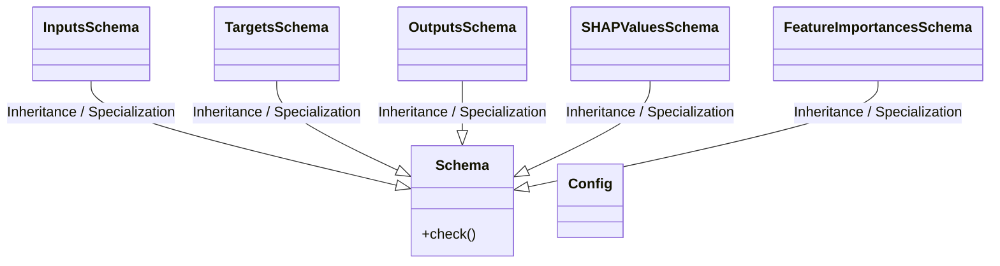
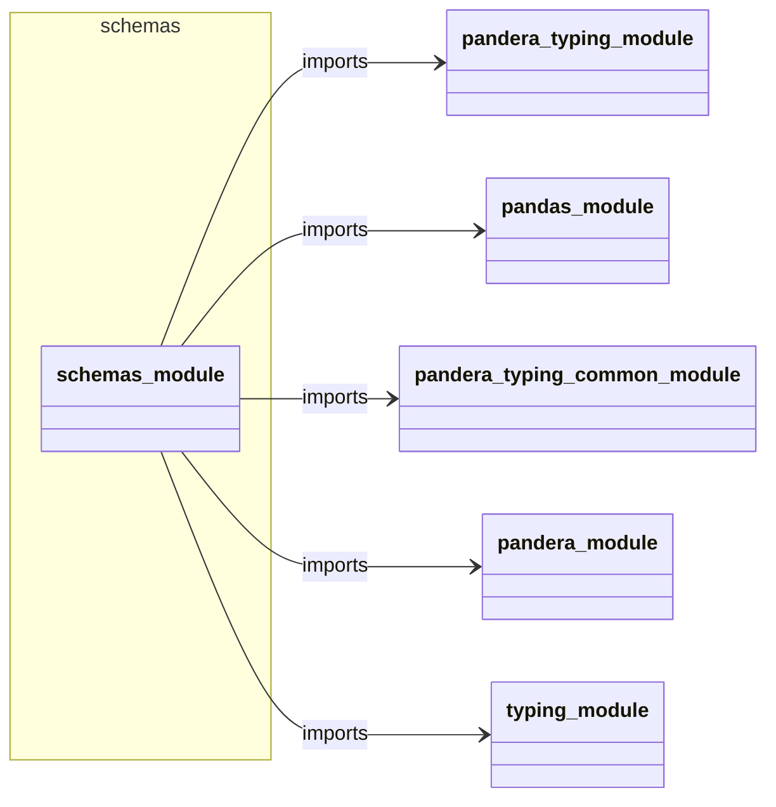
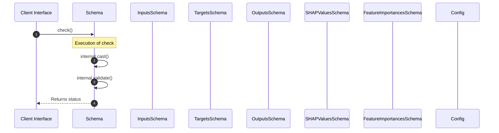

# Module Name: schemas

* **Source Directory Reference:** `src/regression_model_template/core/`
* **Package Dependency:** Upstream: `pandera.typing`, `pandas`, `pandera.typing.common`, `pandera`, `typing` | Downstream: None

## 1. Executive Summary & Purpose
Deterministic architectural model extracted via AST parsing for module `schemas`.

## 2. UML 2.0 Class & Inheritance Architecture (Deterministic)
The following class diagram models the object-oriented structure, explicit inheritance hierarchies, and polymorphic interface implementations derived from local AST analysis:

## 3. Package & Class Relations

The following diagram defines the package boundaries and directional inter-package dependencies:

* **Inheritance & Polymorphism:** Detailed breakdown of abstract base classes, interfaces, and concrete overrides.
* **Dependencies:** How classes within this package collaborate externally.

## 4. Execution Flow & Runtime Behavior

The following sequence diagram outlines the execution lifecycle and message passing during core operations:

---

* **Source Citations:**
  - Class `Schema`: `src/regression_model_template/core/schemas.py:20`
  - Method `check`: `src/regression_model_template/core/schemas.py:39`
  - Class `InputsSchema`: `src/regression_model_template/core/schemas.py:51`
  - Class `TargetsSchema`: `src/regression_model_template/core/schemas.py:75`
  - Class `OutputsSchema`: `src/regression_model_template/core/schemas.py:85`
  - Class `SHAPValuesSchema`: `src/regression_model_template/core/schemas.py:95`
  - Class `FeatureImportancesSchema`: `src/regression_model_template/core/schemas.py:113`
  - Class `Config`: `src/regression_model_template/core/schemas.py:27`
  - Class `Config`: `src/regression_model_template/core/schemas.py:98`
