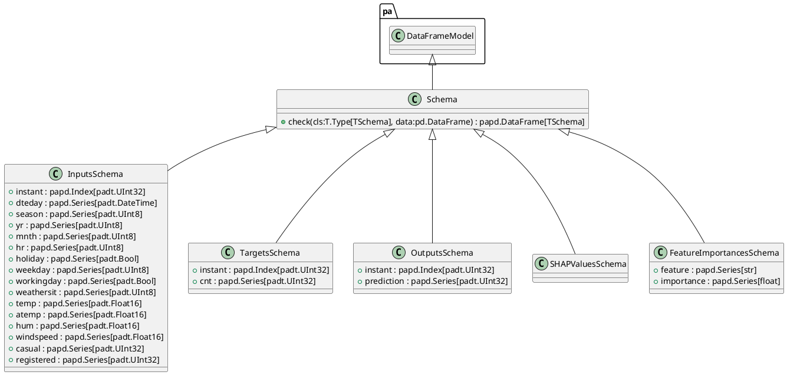
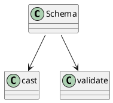

# Module: `src/regression_model_template/core/schemas.py`

## Overview
**Purpose**: Define and validate dataframe schemas.

**Architecture Role**: DTOs

**Dependencies**:
- `typing`
- `pandera.typing.common`
- `pandera.typing`
- `pandera`
- `pandas`

**Exported Symbols**:
- `Schema`
- `InputsSchema`
- `TargetsSchema`
- `OutputsSchema`
- `SHAPValuesSchema`
- `FeatureImportancesSchema`

## UML Class Diagram

## Call Graph

## Classes
### Class `Schema`
**Overview**: Base class for a dataframe schema.

Use a schema to type your dataframe object.
e.g., to communicate and validate its fields.

#### Public Methods
##### `check`
- **Description**: Check the dataframe with this schema.

Args:
    data (pd.DataFrame): dataframe to check.

Returns:
    papd.DataFrame[TSchema]: validated dataframe.
- **Inputs**:
  - `cls`: T.Type[TSchema]
  - `data`: pd.DataFrame
- **Output**: `papd.DataFrame[TSchema]`
- **Side Effects**: Not documented
- **Complexity**: Not documented

#### Private Methods
### Class `InputsSchema`
**Overview**: Schema for the project inputs.

#### Attributes
- `instant`: papd.Index[padt.UInt32]
- `dteday`: papd.Series[padt.DateTime]
- `season`: papd.Series[padt.UInt8]
- `yr`: papd.Series[padt.UInt8]
- `mnth`: papd.Series[padt.UInt8]
- `hr`: papd.Series[padt.UInt8]
- `holiday`: papd.Series[padt.Bool]
- `weekday`: papd.Series[padt.UInt8]
- `workingday`: papd.Series[padt.Bool]
- `weathersit`: papd.Series[padt.UInt8]
- `temp`: papd.Series[padt.Float16]
- `atemp`: papd.Series[padt.Float16]
- `hum`: papd.Series[padt.Float16]
- `windspeed`: papd.Series[padt.Float16]
- `casual`: papd.Series[padt.UInt32]
- `registered`: papd.Series[padt.UInt32]
#### Public Methods
#### Private Methods
### Class `TargetsSchema`
**Overview**: Schema for the project target.

#### Attributes
- `instant`: papd.Index[padt.UInt32]
- `cnt`: papd.Series[padt.UInt32]
#### Public Methods
#### Private Methods
### Class `OutputsSchema`
**Overview**: Schema for the project output.

#### Attributes
- `instant`: papd.Index[padt.UInt32]
- `prediction`: papd.Series[padt.UInt32]
#### Public Methods
#### Private Methods
### Class `SHAPValuesSchema`
**Overview**: Schema for the project shap values.

#### Public Methods
#### Private Methods
### Class `FeatureImportancesSchema`
**Overview**: Schema for the project feature importances.

#### Attributes
- `feature`: papd.Series[str]
- `importance`: papd.Series[float]
#### Public Methods
#### Private Methods
## Functions
