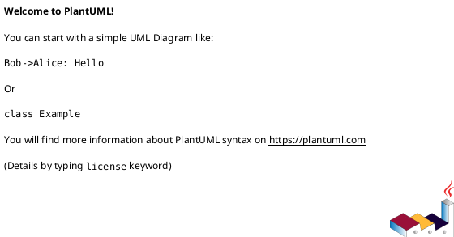
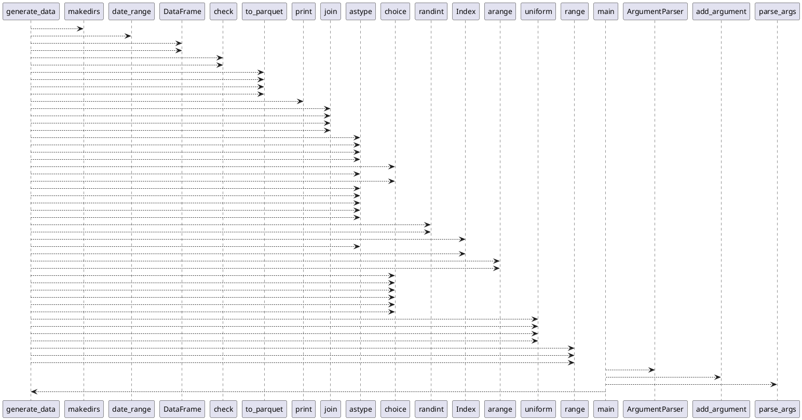

# Module: `src/regression_model_template/init_data.py`

## Overview
**Purpose**: Script to initialize synthetic train and test parquet datasets.

**Architecture Role**: Domain Models

**Dependencies**:
- `numpy`
- `regression_model_template.core.schemas`
- `pandas`
- `os`
- `argparse`

**Exported Symbols**:
- `generate_data`
- `main`

## UML Class Diagram

## Call Graph

## Classes
## Functions
### Function `generate_data`
- **Description**: Generate synthetic regression data and validate schemas.
- **Inputs**:
  - `output_dir`: str
- **Output**: `None`
- **Side Effects**: Not documented
- **Complexity**: Not documented

### Function `main`
- **Description**: CLI entry point for data initialization.
- **Inputs**:
- **Output**: `None`
- **Side Effects**: Not documented
- **Complexity**: Not documented
