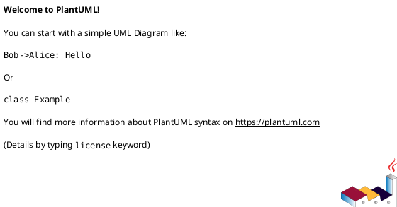
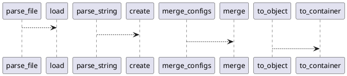

# Module: `src/regression_model_template/io/configs.py`

## Overview
**Purpose**: Parse, merge, and convert config objects.

**Architecture Role**: Domain Models

**Dependencies**:
- `typing`
- `omegaconf`

**Exported Symbols**:
- `parse_file`
- `parse_string`
- `merge_configs`
- `to_object`

## UML Class Diagram

## Call Graph

## Classes
## Functions
### Function `parse_file`
- **Description**: Parse a config file from a path.

Args:
    path (str): path to local config.

Returns:
    Config: representation of the config file.
- **Inputs**:
  - `path`: str
- **Output**: `Config`
- **Side Effects**: Not documented
- **Complexity**: Not documented

### Function `parse_string`
- **Description**: Parse the given config string.

Args:
    string (str): content of config string.

Returns:
    Config: representation of the config string.
- **Inputs**:
  - `string`: str
- **Output**: `Config`
- **Side Effects**: Not documented
- **Complexity**: Not documented

### Function `merge_configs`
- **Description**: Merge a list of config into a single config.

Args:
    configs (T.Sequence[Config]): list of configs.

Returns:
    Config: representation of the merged config objects.
- **Inputs**:
  - `configs`: T.Sequence[Config]
- **Output**: `Config`
- **Side Effects**: Not documented
- **Complexity**: Not documented

### Function `to_object`
- **Description**: Convert a config object to a python object.

Args:
    config (Config): representation of the config.
    resolve (bool): resolve variables. Defaults to True.

Returns:
    object: conversion of the config to a python object.
- **Inputs**:
  - `config`: Config
  - `resolve`: bool
- **Output**: `object`
- **Side Effects**: Not documented
- **Complexity**: Not documented
