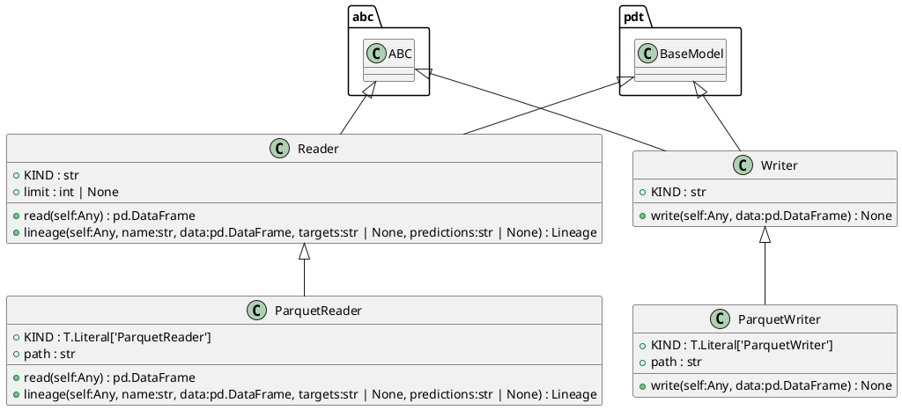
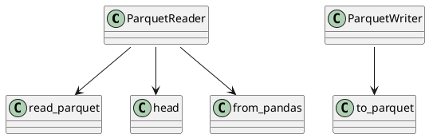

# Module: `src/regression_model_template/io/datasets.py`

## Overview
**Purpose**: Read/Write datasets from/to external sources/destinations.

**Architecture Role**: Domain Models

**Dependencies**:
- `pydantic`
- `mlflow.data.pandas_dataset`
- `typing`
- `abc`
- `pandas`

**Exported Symbols**:
- `Reader`
- `ParquetReader`
- `Writer`
- `ParquetWriter`

## UML Class Diagram

## Call Graph

## Classes
### Class `Reader`
**Overview**: Base class for a dataset reader.

Use a reader to load a dataset in memory.
e.g., to read file, database, cloud storage, ...

Parameters:
    limit (int, optional): maximum number of rows to read. Defaults to None.

#### Attributes
- `KIND`: str
- `limit`: int | None
#### Public Methods
##### `read`
- **Description**: Read a dataframe from a dataset.

Returns:
    pd.DataFrame: dataframe representation.
- **Inputs**:
  - `self`: Any
- **Output**: `pd.DataFrame`
- **Side Effects**: Not documented
- **Complexity**: Not documented

##### `lineage`
- **Description**: Generate lineage information.

Args:
    name (str): dataset name.
    data (pd.DataFrame): reader dataframe.
    targets (str | None): name of the target column.
    predictions (str | None): name of the prediction column.

Returns:
    Lineage: lineage information.
- **Inputs**:
  - `self`: Any
  - `name`: str
  - `data`: pd.DataFrame
  - `targets`: str | None
  - `predictions`: str | None
- **Output**: `Lineage`
- **Side Effects**: Not documented
- **Complexity**: Not documented

#### Private Methods
### Class `ParquetReader`
**Overview**: Read a dataframe from a parquet file.

Parameters:
    path (str): local path to the dataset.

#### Attributes
- `KIND`: T.Literal['ParquetReader']
- `path`: str
#### Public Methods
##### `read`
- **Description**: No description available.
- **Inputs**:
  - `self`: Any
- **Output**: `pd.DataFrame`
- **Side Effects**: Not documented
- **Complexity**: Not documented

##### `lineage`
- **Description**: No description available.
- **Inputs**:
  - `self`: Any
  - `name`: str
  - `data`: pd.DataFrame
  - `targets`: str | None
  - `predictions`: str | None
- **Output**: `Lineage`
- **Side Effects**: Not documented
- **Complexity**: Not documented

#### Private Methods
### Class `Writer`
**Overview**: Base class for a dataset writer.

Use a writer to save a dataset from memory.
e.g., to write file, database, cloud storage, ...

#### Attributes
- `KIND`: str
#### Public Methods
##### `write`
- **Description**: Write a dataframe to a dataset.

Args:
    data (pd.DataFrame): dataframe representation.
- **Inputs**:
  - `self`: Any
  - `data`: pd.DataFrame
- **Output**: `None`
- **Side Effects**: Not documented
- **Complexity**: Not documented

#### Private Methods
### Class `ParquetWriter`
**Overview**: Writer a dataframe to a parquet file.

Parameters:
    path (str): local or S3 path to the dataset.

#### Attributes
- `KIND`: T.Literal['ParquetWriter']
- `path`: str
#### Public Methods
##### `write`
- **Description**: No description available.
- **Inputs**:
  - `self`: Any
  - `data`: pd.DataFrame
- **Output**: `None`
- **Side Effects**: Not documented
- **Complexity**: Not documented

#### Private Methods
## Functions
