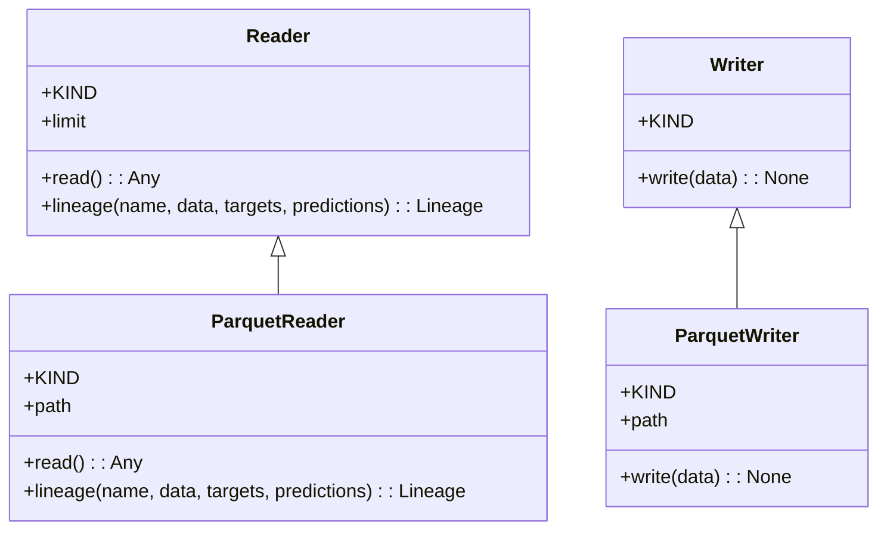
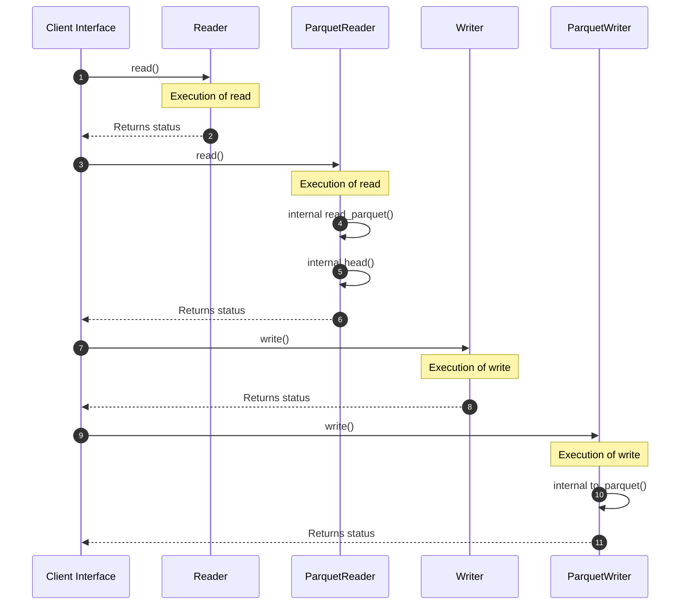
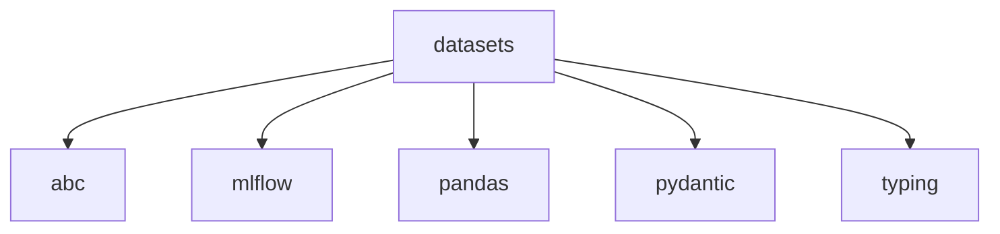

# Module Name: datasets

Source File: `src/regression_model_template/io/datasets.py`
* **Source Directory Reference:** `src/regression_model_template/io/`
* **Package Dependency:** Upstream: `pydantic`, `pandas`, `abc`, `typing`, `mlflow.data.pandas_dataset` | Downstream: None

## 1. Executive Summary & Purpose
Deterministic architectural model extracted via AST parsing for module `datasets`.

## 2. UML 2.0 Class & Inheritance Architecture (Deterministic)
The following class diagram models the object-oriented structure, explicit inheritance hierarchies, and polymorphic interface implementations derived from local AST analysis:

## 3. Package & Class Relations

The following diagram defines the package boundaries and directional inter-package dependencies:

* **Inheritance & Polymorphism:** Detailed breakdown of abstract base classes, interfaces, and concrete overrides.
* **Dependencies:** How classes within this package collaborate externally.

## 4. Execution Flow & Runtime Behavior

The following sequence diagram outlines the execution lifecycle and message passing during core operations:

---

* **Source Citations:**
  - Class `Reader`: `src/regression_model_template/io/datasets.py:19`
  - Method `read`: `src/regression_model_template/io/datasets.py:34`
  - Method `lineage`: `src/regression_model_template/io/datasets.py:42`
  - Class `ParquetReader`: `src/regression_model_template/io/datasets.py:62`
  - Method `read`: `src/regression_model_template/io/datasets.py:73`
  - Method `lineage`: `src/regression_model_template/io/datasets.py:80`
  - Class `Writer`: `src/regression_model_template/io/datasets.py:95`
  - Method `write`: `src/regression_model_template/io/datasets.py:105`
  - Class `ParquetWriter`: `src/regression_model_template/io/datasets.py:113`
  - Method `write`: `src/regression_model_template/io/datasets.py:124`

