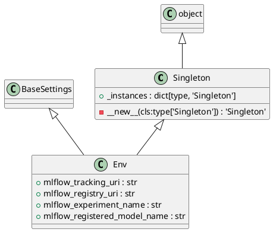
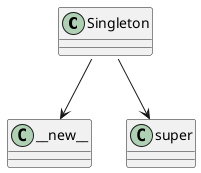

# Module: `src/regression_model_template/io/osvariables.py`

## Overview
**Purpose**: Module providing various functionalities.

**Architecture Role**: Domain Models

**Dependencies**:
- `typing`
- `pydantic_settings`

**Exported Symbols**:
- `Singleton`
- `Env`

## UML Class Diagram

## Call Graph

## Classes
### Class `Singleton`
**Overview**: No description available.

#### Attributes
- `_instances`: dict[type, 'Singleton']
#### Public Methods
#### Private Methods
##### `__new__`
- **Purpose**: No description available.
- **Parameters**: cls
- **Return**: `'Singleton'`

### Class `Env`
**Overview**: No description available.

#### Attributes
- `mlflow_tracking_uri`: str
- `mlflow_registry_uri`: str
- `mlflow_experiment_name`: str
- `mlflow_registered_model_name`: str
#### Public Methods
#### Private Methods
## Functions
