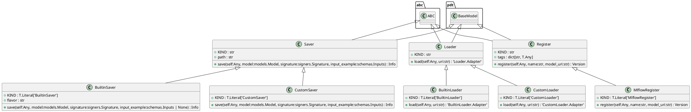
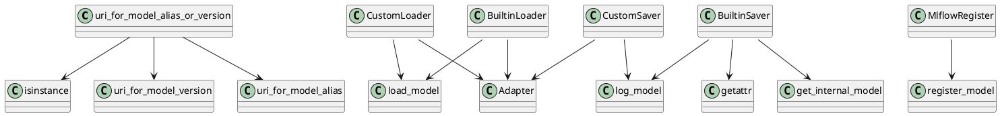

# Module: `src/regression_model_template/io/registries.py`

## Overview
**Purpose**: Savers, loaders, and registers for model registries.

**Architecture Role**: Domain Models

**Dependencies**:
- `pydantic`
- `typing`
- `abc`
- `mlflow`
- `regression_model_template.core`
- `regression_model_template.utils`

**Exported Symbols**:
- `uri_for_model_alias`
- `uri_for_model_version`
- `uri_for_model_alias_or_version`
- `Saver`
- `CustomSaver`
- `BuiltinSaver`
- `Loader`
- `CustomLoader`
- `BuiltinLoader`
- `Register`
- `MlflowRegister`

## UML Class Diagram

## Call Graph

## Classes
### Class `Saver`
**Overview**: Base class for saving models in registry.

Separate model definition from serialization.
e.g., to switch between serialization flavors.

Parameters:
    path (str): model path inside the Mlflow store.

#### Attributes
- `KIND`: str
- `path`: str
#### Public Methods
##### `save`
- **Description**: Save a model in the model registry.

Args:
    model (models.Model): project model to save.
    signature (signers.Signature): model signature.
    input_example (schemas.Inputs): sample of inputs.

Returns:
    Info: model saving information.
- **Inputs**:
  - `self`: Any
  - `model`: models.Model
  - `signature`: signers.Signature
  - `input_example`: schemas.Inputs
- **Output**: `Info`
- **Side Effects**: Not documented
- **Complexity**: Not documented

#### Private Methods
### Class `CustomSaver`
**Overview**: Saver for project models using the Mlflow PyFunc module.

https://mlflow.org/docs/latest/python_api/mlflow.pyfunc.html

#### Attributes
- `KIND`: T.Literal['CustomSaver']
#### Public Methods
##### `save`
- **Description**: No description available.
- **Inputs**:
  - `self`: Any
  - `model`: models.Model
  - `signature`: signers.Signature
  - `input_example`: schemas.Inputs
- **Output**: `Info`
- **Side Effects**: Not documented
- **Complexity**: Not documented

#### Private Methods
### Class `BuiltinSaver`
**Overview**: Saver for built-in models using an Mlflow flavor module.

https://mlflow.org/docs/latest/models.html#built-in-model-flavors

Parameters:
    flavor (str): Mlflow flavor module to use for the serialization.

#### Attributes
- `KIND`: T.Literal['BuiltinSaver']
- `flavor`: str
#### Public Methods
##### `save`
- **Description**: No description available.
- **Inputs**:
  - `self`: Any
  - `model`: models.Model
  - `signature`: signers.Signature
  - `input_example`: schemas.Inputs | None
- **Output**: `Info`
- **Side Effects**: Not documented
- **Complexity**: Not documented

#### Private Methods
### Class `Loader`
**Overview**: Base class for loading models from registry.

Separate model definition from deserialization.
e.g., to switch between deserialization flavors.

#### Attributes
- `KIND`: str
#### Public Methods
##### `load`
- **Description**: Load a model from the model registry.

Args:
    uri (str): URI of a model to load.

Returns:
    Loader.Adapter: model loaded.
- **Inputs**:
  - `self`: Any
  - `uri`: str
- **Output**: `'Loader.Adapter'`
- **Side Effects**: Not documented
- **Complexity**: Not documented

#### Private Methods
### Class `CustomLoader`
**Overview**: Loader for custom models using the Mlflow PyFunc module.

https://mlflow.org/docs/latest/python_api/mlflow.pyfunc.html

#### Attributes
- `KIND`: T.Literal['CustomLoader']
#### Public Methods
##### `load`
- **Description**: No description available.
- **Inputs**:
  - `self`: Any
  - `uri`: str
- **Output**: `'CustomLoader.Adapter'`
- **Side Effects**: Not documented
- **Complexity**: Not documented

#### Private Methods
### Class `BuiltinLoader`
**Overview**: Loader for built-in models using the Mlflow PyFunc module.

Note: use Mlflow PyFunc instead of flavors to use standard API.

https://mlflow.org/docs/latest/models.html#built-in-model-flavors

#### Attributes
- `KIND`: T.Literal['BuiltinLoader']
#### Public Methods
##### `load`
- **Description**: No description available.
- **Inputs**:
  - `self`: Any
  - `uri`: str
- **Output**: `'BuiltinLoader.Adapter'`
- **Side Effects**: Not documented
- **Complexity**: Not documented

#### Private Methods
### Class `Register`
**Overview**: Base class for registring models to a location.

Separate model definition from its registration.
e.g., to change the model registry backend.

Parameters:
    tags (dict[str, T.Any]): tags for the model.

#### Attributes
- `KIND`: str
- `tags`: dict[str, T.Any]
#### Public Methods
##### `register`
- **Description**: Register a model given its name and URI.

Args:
    name (str): name of the model to register.
    model_uri (str): URI of a model to register.

Returns:
    Version: information about the registered model.
- **Inputs**:
  - `self`: Any
  - `name`: str
  - `model_uri`: str
- **Output**: `Version`
- **Side Effects**: Not documented
- **Complexity**: Not documented

#### Private Methods
### Class `MlflowRegister`
**Overview**: Register for models in the Mlflow Model Registry.

https://mlflow.org/docs/latest/model-registry.html

#### Attributes
- `KIND`: T.Literal['MlflowRegister']
#### Public Methods
##### `register`
- **Description**: No description available.
- **Inputs**:
  - `self`: Any
  - `name`: str
  - `model_uri`: str
- **Output**: `Version`
- **Side Effects**: Not documented
- **Complexity**: Not documented

#### Private Methods
## Functions
### Function `uri_for_model_alias`
- **Description**: Create a model URI from a model name and an alias.

Args:
    name (str): name of the mlflow registered model.
    alias (str): alias of the registered model.

Returns:
    str: model URI as "models:/name@alias".
- **Inputs**:
  - `name`: str
  - `alias`: str
- **Output**: `str`
- **Side Effects**: Not documented
- **Complexity**: Not documented

### Function `uri_for_model_version`
- **Description**: Create a model URI from a model name and a version.

Args:
    name (str): name of the mlflow registered model.
    version (int): version of the registered model.

Returns:
    str: model URI as "models:/name/version."
- **Inputs**:
  - `name`: str
  - `version`: int
- **Output**: `str`
- **Side Effects**: Not documented
- **Complexity**: Not documented

### Function `uri_for_model_alias_or_version`
- **Description**: Create a model URi from a model name and an alias or version.

Args:
    name (str): name of the mlflow registered model.
    alias_or_version (str | int): alias or version of the registered model.

Returns:
    str: model URI as "models:/name@alias" or "models:/name/version" based on input.
- **Inputs**:
  - `name`: str
  - `alias_or_version`: str | int
- **Output**: `str`
- **Side Effects**: Not documented
- **Complexity**: Not documented
