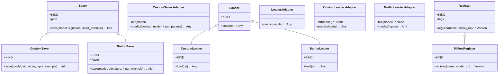
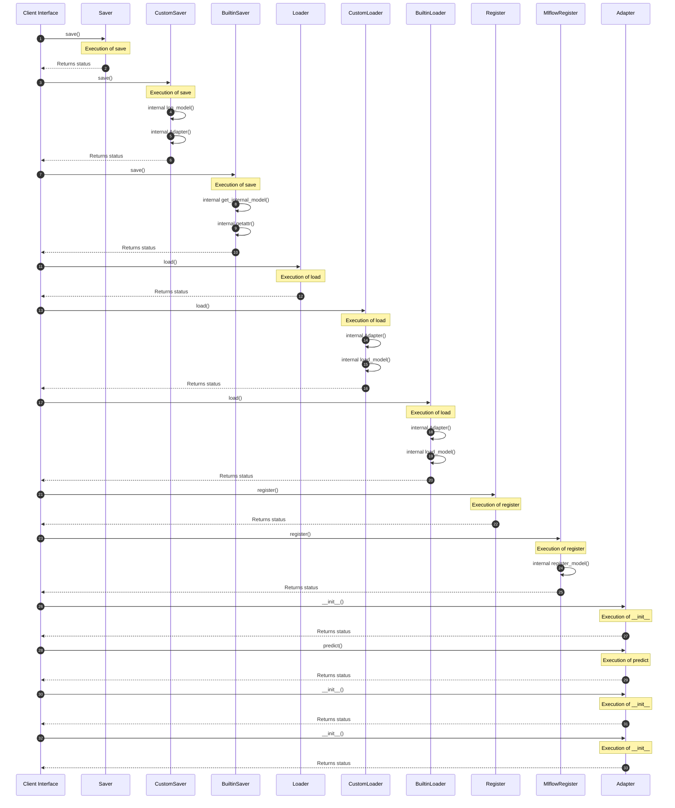
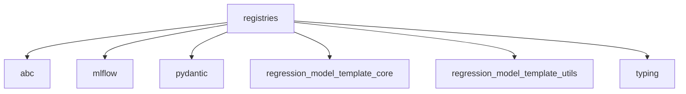

# Module Name: registries

Source File: `src/regression_model_template/io/registries.py`
* **Source Directory Reference:** `src/regression_model_template/io/`
* **Package Dependency:** Upstream: `pydantic`, `mlflow`, `regression_model_template.utils`, `abc`, `typing`, `regression_model_template.core` | Downstream: None

## 1. Executive Summary & Purpose
Deterministic architectural model extracted via AST parsing for module `registries`.

## 2. UML 2.0 Class & Inheritance Architecture (Deterministic)
The following class diagram models the object-oriented structure, explicit inheritance hierarchies, and polymorphic interface implementations derived from local AST analysis:

## 3. Package & Class Relations

The following diagram defines the package boundaries and directional inter-package dependencies:

* **Inheritance & Polymorphism:** Detailed breakdown of abstract base classes, interfaces, and concrete overrides.
* **Dependencies:** How classes within this package collaborate externally.

## 4. Execution Flow & Runtime Behavior

The following sequence diagram outlines the execution lifecycle and message passing during core operations:

---

* **Source Citations:**
  - Class `Saver`: `src/regression_model_template/io/registries.py:69`
  - Method `save`: `src/regression_model_template/io/registries.py:84`
  - Class `CustomSaver`: `src/regression_model_template/io/registries.py:97`
  - Method `save`: `src/regression_model_template/io/registries.py:138`
  - Class `BuiltinSaver`: `src/regression_model_template/io/registries.py:148`
  - Method `save`: `src/regression_model_template/io/registries.py:161`
  - Class `Loader`: `src/regression_model_template/io/registries.py:179`
  - Method `load`: `src/regression_model_template/io/registries.py:203`
  - Class `CustomLoader`: `src/regression_model_template/io/registries.py:214`
  - Method `load`: `src/regression_model_template/io/registries.py:238`
  - Class `BuiltinLoader`: `src/regression_model_template/io/registries.py:244`
  - Method `load`: `src/regression_model_template/io/registries.py:270`
  - Class `Register`: `src/regression_model_template/io/registries.py:281`
  - Method `register`: `src/regression_model_template/io/registries.py:296`
  - Class `MlflowRegister`: `src/regression_model_template/io/registries.py:308`
  - Method `register`: `src/regression_model_template/io/registries.py:316`
  - Class `Adapter`: `src/regression_model_template/io/registries.py:105`
  - Method `__init__`: `src/regression_model_template/io/registries.py:111`
  - Method `predict`: `src/regression_model_template/io/registries.py:119`
  - Class `Adapter`: `src/regression_model_template/io/registries.py:188`
  - Method `predict`: `src/regression_model_template/io/registries.py:192`
  - Class `Adapter`: `src/regression_model_template/io/registries.py:222`
  - Method `__init__`: `src/regression_model_template/io/registries.py:225`
  - Method `predict`: `src/regression_model_template/io/registries.py:233`
  - Class `Adapter`: `src/regression_model_template/io/registries.py:254`
  - Method `__init__`: `src/regression_model_template/io/registries.py:257`
  - Method `predict`: `src/regression_model_template/io/registries.py:265`

