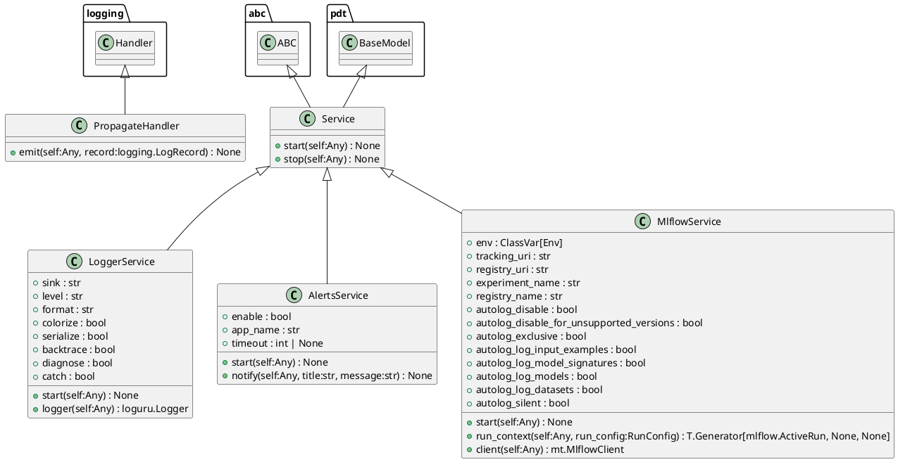

# Module: `src/regression_model_template/io/services.py`

## Overview
**Purpose**: Manage global context during execution.

**Architecture Role**: Services

**Dependencies**:
- `plyer`
- `opentelemetry.sdk.resources`
- `mlflow`
- `opentelemetry.exporter.otlp.proto.http.trace_exporter`
- `opentelemetry.exporter.otlp.proto.http._log_exporter`
- `pydantic`
- `sys`
- `mlflow.tracking`
- `opentelemetry`
- `__future__`
- `loguru`
- `opentelemetry.sdk._logs.export`
- `logging`
- `opentelemetry.sdk.trace`
- `typing`
- `opentelemetry.sdk.trace.export`
- `contextlib`
- `opentelemetry._logs`
- `regression_model_template.io.osvariables`
- `opentelemetry.sdk._logs`
- `abc`

**Exported Symbols**:
- `PropagateHandler`
- `Service`
- `LoggerService`
- `AlertsService`
- `MlflowService`

## UML Class Diagram

## Call Graph

```plantuml
@startuml
PropagateHandler::emit --> handle
PropagateHandler::emit --> getLogger
LoggerService::start --> create
LoggerService::start --> TracerProvider
LoggerService::start --> set_tracer_provider
LoggerService::start --> OTLPSpanExporter
LoggerService::start --> add_span_processor
LoggerService::start --> LoggerProvider
LoggerService::start --> set_logger_provider
LoggerService::start --> OTLPLogExporter
LoggerService::start --> add_log_record_processor
LoggerService::start --> LoggingHandler
LoggerService::start --> addHandler
LoggerService::start --> basicConfig
LoggerService::start --> getLogger
LoggerService::start --> info
LoggerService::start --> remove
LoggerService::start --> model_dump
LoggerService::start --> get
LoggerService::start --> add
LoggerService::start --> add
LoggerService::start --> BatchSpanProcessor
LoggerService::start --> BatchLogRecordProcessor
LoggerService::start --> PropagateHandler
LoggerService::start --> getLogger
AlertsService::notify --> notify
AlertsService::notify --> print
MlflowService::start --> set_tracking_uri
MlflowService::start --> set_registry_uri
MlflowService::start --> set_experiment
MlflowService::start --> autolog
MlflowService::run_context --> start_run
MlflowService::client --> MlflowClient
@enduml
```

## Classes
### Class `PropagateHandler`
**Overview**: No description available.

#### Public Methods
##### `emit`
- **Description**: No description available.
- **Inputs**:
  - `self`: Any
  - `record`: logging.LogRecord
- **Output**: `None`
- **Side Effects**: Not documented
- **Complexity**: Not documented

#### Private Methods
### Class `Service`
**Overview**: Base class for a global service.

Use services to manage global contexts.
e.g., logger object, mlflow client, spark context, ...

#### Public Methods
##### `start`
- **Description**: Start the service.
- **Inputs**:
  - `self`: Any
- **Output**: `None`
- **Side Effects**: Not documented
- **Complexity**: Not documented

##### `stop`
- **Description**: Stop the service.
- **Inputs**:
  - `self`: Any
- **Output**: `None`
- **Side Effects**: Not documented
- **Complexity**: Not documented

#### Private Methods
### Class `LoggerService`
**Overview**: Service for logging messages.

https://loguru.readthedocs.io/en/stable/api/logger.html

Parameters:
    sink (str): logging output.
    level (str): logging level.
    format (str): logging format.
    colorize (bool): colorize output.
    serialize (bool): convert to JSON.
    backtrace (bool): enable exception trace.
    diagnose (bool): enable variable display.
    catch (bool): catch errors during log handling.

#### Attributes
- `sink`: str
- `level`: str
- `format`: str
- `colorize`: bool
- `serialize`: bool
- `backtrace`: bool
- `diagnose`: bool
- `catch`: bool
#### Public Methods
##### `start`
- **Description**: No description available.
- **Inputs**:
  - `self`: Any
- **Output**: `None`
- **Side Effects**: Not documented
- **Complexity**: Not documented

##### `logger`
- **Description**: Return the main logger.

Returns:
    loguru.Logger: the main logger.
- **Inputs**:
  - `self`: Any
- **Output**: `loguru.Logger`
- **Side Effects**: Not documented
- **Complexity**: Not documented

#### Private Methods
### Class `AlertsService`
**Overview**: Service for sending notifications.

Require libnotify-bin on Linux systems.

In production, use with Slack, Discord, or emails.

https://plyer.readthedocs.io/en/latest/api.html#plyer.facades.Notification

Parameters:
    enable (bool): use notifications or print.
    app_name (str): name of the application.
    timeout (int | None): timeout in secs.

#### Attributes
- `enable`: bool
- `app_name`: str
- `timeout`: int | None
#### Public Methods
##### `start`
- **Description**: No description available.
- **Inputs**:
  - `self`: Any
- **Output**: `None`
- **Side Effects**: Not documented
- **Complexity**: Not documented

##### `notify`
- **Description**: Send a notification to the system.

Args:
    title (str): title of the notification.
    message (str): message of the notification.
- **Inputs**:
  - `self`: Any
  - `title`: str
  - `message`: str
- **Output**: `None`
- **Side Effects**: Not documented
- **Complexity**: Not documented

#### Private Methods
### Class `MlflowService`
**Overview**: Service for Mlflow tracking and registry.

Parameters:
    tracking_uri (str): the URI for the Mlflow tracking server.
    registry_uri (str): the URI for the Mlflow model registry.
    experiment_name (str): the name of tracking experiment.
    registry_name (str): the name of model registry.
    autolog_disable (bool): disable autologging.
    autolog_disable_for_unsupported_versions (bool): disable autologging for unsupported versions.
    autolog_exclusive (bool): If True, enables exclusive autologging.
    autolog_log_input_examples (bool): If True, logs input examples during autologging.
    autolog_log_model_signatures (bool): If True, logs model signatures during autologging.
    autolog_log_models (bool): If True, enables logging of models during autologging.
    autolog_log_datasets (bool): If True, logs datasets used during autologging.
    autolog_silent (bool): If True, suppresses all Mlflow warnings during autologging.

#### Attributes
- `env`: ClassVar[Env]
- `tracking_uri`: str
- `registry_uri`: str
- `experiment_name`: str
- `registry_name`: str
- `autolog_disable`: bool
- `autolog_disable_for_unsupported_versions`: bool
- `autolog_exclusive`: bool
- `autolog_log_input_examples`: bool
- `autolog_log_model_signatures`: bool
- `autolog_log_models`: bool
- `autolog_log_datasets`: bool
- `autolog_silent`: bool
#### Public Methods
##### `start`
- **Description**: No description available.
- **Inputs**:
  - `self`: Any
- **Output**: `None`
- **Side Effects**: Not documented
- **Complexity**: Not documented

##### `run_context`
- **Description**: Yield an active Mlflow run and exit it afterwards.

Args:
    run (str): run parameters.

Yields:
    T.Generator[mlflow.ActiveRun, None, None]: active run context. Will be closed as the end of context.
- **Inputs**:
  - `self`: Any
  - `run_config`: RunConfig
- **Output**: `T.Generator[mlflow.ActiveRun, None, None]`
- **Side Effects**: Not documented
- **Complexity**: Not documented

##### `client`
- **Description**: Return a new Mlflow client.

Returns:
    MlflowClient: the mlflow client.
- **Inputs**:
  - `self`: Any
- **Output**: `mt.MlflowClient`
- **Side Effects**: Not documented
- **Complexity**: Not documented

#### Private Methods
## Functions
