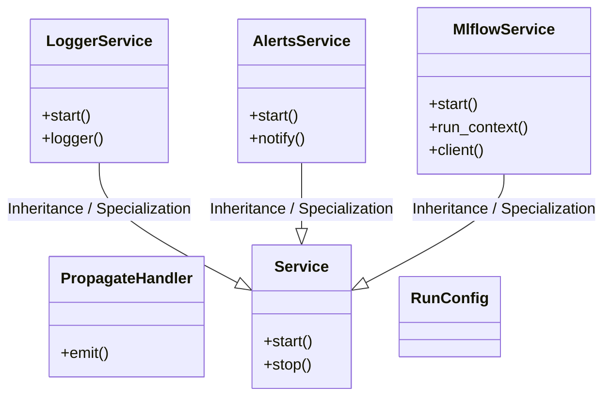
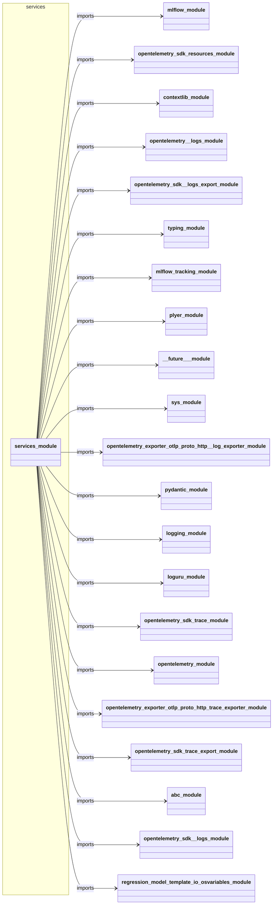
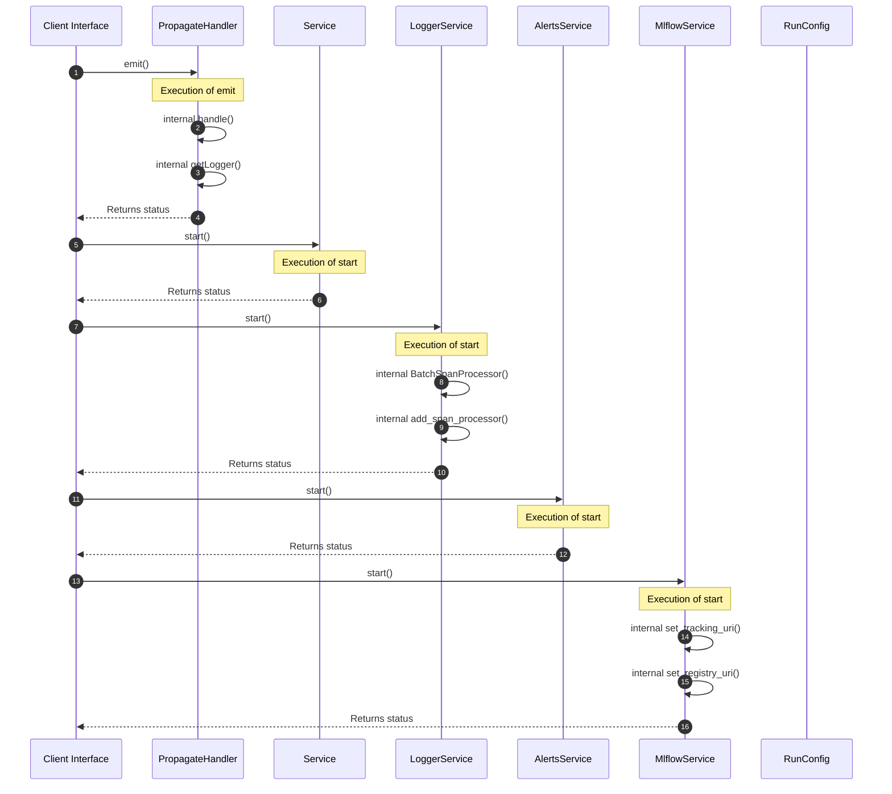

# Module Name: services

* **Source Directory Reference:** `src/regression_model_template/io/`
* **Package Dependency:** Upstream: `mlflow`, `opentelemetry.sdk.resources`, `contextlib`, `opentelemetry._logs`, `opentelemetry.sdk._logs.export`, `typing`, `mlflow.tracking`, `plyer`, `__future__`, `sys`, `opentelemetry.exporter.otlp.proto.http._log_exporter`, `pydantic`, `logging`, `loguru`, `opentelemetry.sdk.trace`, `opentelemetry`, `opentelemetry.exporter.otlp.proto.http.trace_exporter`, `opentelemetry.sdk.trace.export`, `abc`, `opentelemetry.sdk._logs`, `regression_model_template.io.osvariables` | Downstream: None

## 1. Executive Summary & Purpose
Deterministic architectural model extracted via AST parsing for module `services`.

## 2. UML 2.0 Class & Inheritance Architecture (Deterministic)
The following class diagram models the object-oriented structure, explicit inheritance hierarchies, and polymorphic interface implementations derived from local AST analysis:

## 3. Package & Class Relations

The following diagram defines the package boundaries and directional inter-package dependencies:

* **Inheritance & Polymorphism:** Detailed breakdown of abstract base classes, interfaces, and concrete overrides.
* **Dependencies:** How classes within this package collaborate externally.

## 4. Execution Flow & Runtime Behavior

The following sequence diagram outlines the execution lifecycle and message passing during core operations:

---

* **Source Citations:**
  - Class `PropagateHandler`: `src/regression_model_template/io/services.py:33`
  - Method `emit`: `src/regression_model_template/io/services.py:34`
  - Class `Service`: `src/regression_model_template/io/services.py:38`
  - Method `start`: `src/regression_model_template/io/services.py:46`
  - Method `stop`: `src/regression_model_template/io/services.py:49`
  - Class `LoggerService`: `src/regression_model_template/io/services.py:54`
  - Method `start`: `src/regression_model_template/io/services.py:84`
  - Method `logger`: `src/regression_model_template/io/services.py:118`
  - Class `AlertsService`: `src/regression_model_template/io/services.py:127`
  - Method `start`: `src/regression_model_template/io/services.py:146`
  - Method `notify`: `src/regression_model_template/io/services.py:149`
  - Class `MlflowService`: `src/regression_model_template/io/services.py:162`
  - Method `start`: `src/regression_model_template/io/services.py:211`
  - Method `run_context`: `src/regression_model_template/io/services.py:229`
  - Method `client`: `src/regression_model_template/io/services.py:246`
  - Class `RunConfig`: `src/regression_model_template/io/services.py:180`
