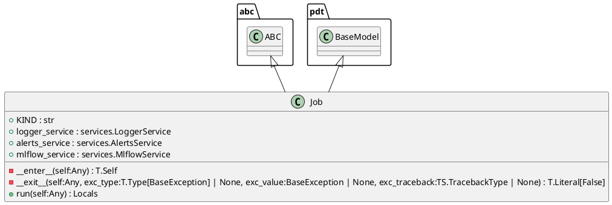
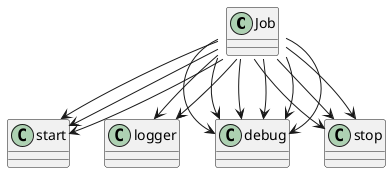

# Module: `src/regression_model_template/jobs/base.py`

## Overview
**Purpose**: Base for high-level project jobs.

**Architecture Role**: Domain Models

**Dependencies**:
- `pydantic`
- `typing`
- `types`
- `abc`
- `regression_model_template.io`

**Exported Symbols**:
- `Job`

## UML Class Diagram

## Call Graph

## Classes
### Class `Job`
**Overview**: Base class for a job.

use a job to execute runs in  context.
e.g., to define common services like logger

Parameters:
    logger_service (services.LoggerService): manage the logger system.
    alerts_service (services.AlertsService): manage the alerts system.
    mlflow_service (services.MlflowService): manage the mlflow system.

#### Attributes
- `KIND`: str
- `logger_service`: services.LoggerService
- `alerts_service`: services.AlertsService
- `mlflow_service`: services.MlflowService
#### Public Methods
##### `run`
- **Description**: Run the job in context.

Returns:
    Locals: local job variables.
- **Inputs**:
  - `self`: Any
- **Output**: `Locals`
- **Side Effects**: Not documented
- **Complexity**: Not documented

#### Private Methods
##### `__enter__`
- **Purpose**: Enter the job context.

Returns:
    T.Self: return the current object.
- **Parameters**: self
- **Return**: `T.Self`

##### `__exit__`
- **Purpose**: Exit the job context.

Args:
    exc_type (T.Type[BaseException] | None): ignored.
    exc_value (BaseException | None): ignored.
    exc_traceback (TS.TracebackType | None): ignored.

Returns:
    T.Literal[False]: always propagate exceptions.
- **Parameters**: self, exc_type, exc_value, exc_traceback
- **Return**: `T.Literal[False]`

## Functions
