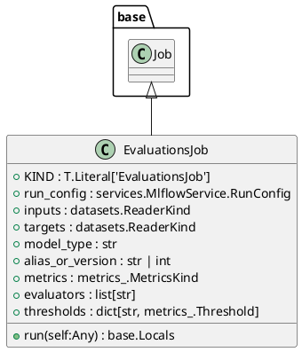

# Module: `src/regression_model_template/jobs/evaluations.py`

## Overview
**Purpose**: Define a job for evaluating registered models with data.

**Architecture Role**: Domain Models

**Dependencies**:
- `pydantic`
- `regression_model_template.core`
- `typing`
- `mlflow`
- `regression_model_template.jobs`
- `pandas`
- `regression_model_template.io`

**Exported Symbols**:
- `EvaluationsJob`

## UML Class Diagram

## Call Graph

```plantuml
@startuml
EvaluationsJob::run --> logger
EvaluationsJob::run --> info
EvaluationsJob::run --> client
EvaluationsJob::run --> info
EvaluationsJob::run --> locals
EvaluationsJob::run --> run_context
EvaluationsJob::run --> info
EvaluationsJob::run --> info
EvaluationsJob::run --> read
EvaluationsJob::run --> check
EvaluationsJob::run --> debug
EvaluationsJob::run --> info
EvaluationsJob::run --> read
EvaluationsJob::run --> check
EvaluationsJob::run --> debug
EvaluationsJob::run --> info
EvaluationsJob::run --> lineage
EvaluationsJob::run --> log_input
EvaluationsJob::run --> debug
EvaluationsJob::run --> info
EvaluationsJob::run --> lineage
EvaluationsJob::run --> log_input
EvaluationsJob::run --> debug
EvaluationsJob::run --> info
EvaluationsJob::run --> from_pandas
EvaluationsJob::run --> debug
EvaluationsJob::run --> info
EvaluationsJob::run --> uri_for_model_alias_or_version
EvaluationsJob::run --> debug
EvaluationsJob::run --> debug
EvaluationsJob::run --> debug
EvaluationsJob::run --> info
EvaluationsJob::run --> debug
EvaluationsJob::run --> info
EvaluationsJob::run --> evaluate
EvaluationsJob::run --> validate_evaluation_results
EvaluationsJob::run --> debug
EvaluationsJob::run --> notify
EvaluationsJob::run --> to_dict
EvaluationsJob::run --> to_dict
EvaluationsJob::run --> to_dict
EvaluationsJob::run --> to_mlflow
EvaluationsJob::run --> to_mlflow
EvaluationsJob::run --> concat
EvaluationsJob::run --> items
@enduml
```

## Classes
### Class `EvaluationsJob`
**Overview**: Generate evaluations from a registered model and a dataset.

Parameters:
    run_config (services.MlflowService.RunConfig): mlflow run config.
    inputs (datasets.ReaderKind): reader for the inputs data.
    targets (datasets.ReaderKind): reader for the targets data.
    model_type (str): model type (e.g. "regressor", "classifier").
    alias_or_version (str | int): alias or version for the  model.
    metrics (metrics_.MetricKind): metrics for the reporting.
    evaluators (list[str]): list of evaluators to use.
    thresholds (dict[str, metrics_.Threshold] | None): metric thresholds.

#### Attributes
- `KIND`: T.Literal['EvaluationsJob']
- `run_config`: services.MlflowService.RunConfig
- `inputs`: datasets.ReaderKind
- `targets`: datasets.ReaderKind
- `model_type`: str
- `alias_or_version`: str | int
- `metrics`: metrics_.MetricsKind
- `evaluators`: list[str]
- `thresholds`: dict[str, metrics_.Threshold]
#### Public Methods
##### `run`
- **Description**: No description available.
- **Inputs**:
  - `self`: Any
- **Output**: `base.Locals`
- **Side Effects**: Not documented
- **Complexity**: Not documented

#### Private Methods
## Functions
